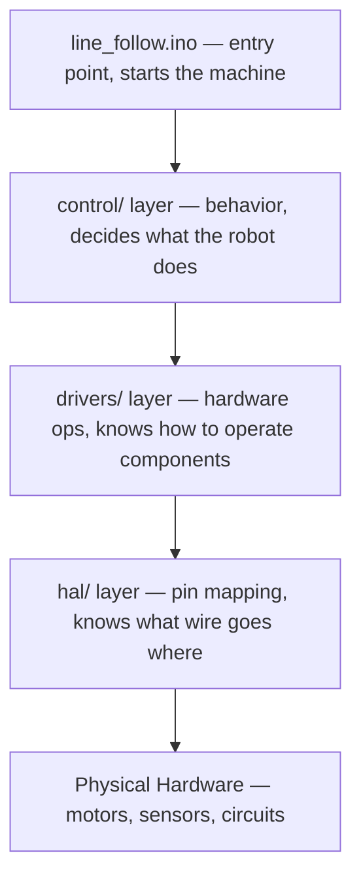

# Arduino / C++ Rover Architecture Guide

> **Jim The STEAM Clown Edition** — Modular Design Using Arduino IDE, Line Following Rover Reference Design

---

## 🧭 Overview

This guide explains how to structure a modular Arduino-based robotics project using a **line-following rover** as the reference design.

The goal is to move from a single-file Arduino sketch to a **professional embedded systems architecture** using:

- Control layer (robot behavior)
- Drivers layer (hardware abstraction)
- HAL (hardware pin mapping)
- Utilities (PID and math tools)
- Arduino IDE-compatible project structure

This is not just a code style preference — it mirrors the architecture used in professional embedded systems development in the automotive, aerospace, and consumer robotics industries. Learning this structure now means learning the same thought patterns that real firmware engineers use every day.

---

## 📁 Recommended Project Structure

```text
/arduino/examples/line_follow/
│
├── line_follow.ino          ← Entry point only. No logic lives here.
│
├── /control/
│   ├── line_follow.cpp      ← Behavior: "what does the robot do?"
│   └── line_follow.h        ← Public interface declaration
│
├── /drivers/
│   ├── motors.cpp           ← Hardware ops: "how do we spin a motor?"
│   ├── motors.h
│   ├── line_sensor.cpp      ← Hardware ops: "how do we read a sensor?"
│   └── line_sensor.h
│
├── /hal/
│   ├── pins.h               ← Declares that pin constants EXIST (extern)
│   └── pins.cpp             ← Defines the ACTUAL pin values. Only file you edit when rewiring.
│
└── /utils/
    ├── pid.cpp              ← Math: reusable, hardware-free algorithm
    └── pid.h
```

> **Why does `/hal/` need TWO files?** This is one of the most important questions in the whole architecture. The answer has everything to do with how the C++ compiler and linker work. It is covered in full detail in Section 4.

---

## 🧠 Design Philosophy

This architecture follows a **layered embedded systems model**. Each layer only knows about the layer directly below it, and each layer has exactly one job.



Think of it like a restaurant kitchen: the manager doesn't flip burgers, the line cook doesn't take customer orders, and the dishwasher doesn't decide the menu. Every role is separated so the whole system runs without confusion.

---

## 🔩 Why `.h` and `.cpp` Files — A Deep Dive

This is one of the most confusing concepts for students coming from single-file Arduino sketches, so it deserves a full explanation before diving into layers.

### The Problem With One Big File

In a simple Arduino sketch, everything lives in one `.ino` file. That works fine for blinking an LED. But as your project grows — motors, sensors, PID, communication, behavior modes — that single file becomes a tangled mess. Variables collide, functions are hard to find, and changing one thing breaks another.

More importantly, there is no separation between *what the robot does* and *how the hardware works*. If you ever swap a motor driver, you have to dig through hundreds of lines of code hunting for anything motor-related.

### What a `.h` File Is For — The Declaration

A `.h` (header) file is a **contract**. It is a list of promises: "These functions exist. These variables exist. Here is what types they accept and what they return." A header file contains **declarations**, not implementations.

Think of a header file like a restaurant menu. The menu tells you what dishes are available and what you can order — but it does not describe the recipe or how the food is made. That is the job of the kitchen.

```cpp
// motors.h — The menu. What can you order?
#ifndef MOTORS_H
#define MOTORS_H

void initMotors();
void setMotorSpeed(int left, int right);
void stopMotors();

#endif
```

When another file does `#include "motors.h"`, it gains access to that menu. It now knows those functions exist and what arguments they take. It does not need to know anything about how they work internally.

The `#ifndef / #define / #endif` block is called an **include guard**. It prevents the header from being pasted into the compiler twice if multiple files include it, which would cause duplicate declaration errors. Every `.h` file you write should have one, named after the file — for example, `MOTORS_H`, `LINE_SENSOR_H`, `PID_H`.

### What a `.cpp` File Is For — The Implementation

A `.cpp` file is the **kitchen**. It is where the actual work happens. It `#include`s its own header to confirm it is fulfilling the contract, `#include`s whatever it needs from lower layers, and implements every function declared in the `.h`.

```cpp
// motors.cpp — The kitchen. How is it actually done?
#include "motors.h"         // Include our own contract
#include "../hal/pins.h"    // Need pin assignments
#include <Arduino.h>        // Need analogWrite, pinMode, etc.

void initMotors() {
    pinMode(MOTOR_LEFT_PWM, OUTPUT);
    pinMode(MOTOR_RIGHT_PWM, OUTPUT);
}

void setMotorSpeed(int left, int right) {
    analogWrite(MOTOR_LEFT_PWM, constrain(left, 0, 255));
    analogWrite(MOTOR_RIGHT_PWM, constrain(right, 0, 255));
}

void stopMotors() {
    analogWrite(MOTOR_LEFT_PWM, 0);
    analogWrite(MOTOR_RIGHT_PWM, 0);
}
```

The critical insight is that `motors.cpp` is the **only file in the entire project** that contains `analogWrite` calls for the motors. No other file knows how a motor is driven.

### The Compiler's Perspective

When you build your project, the compiler handles each `.cpp` file independently, turning each one into an object file (`.o`). The linker then connects them all together. The `.h` files allow the compiler to type-check calls across files — when `line_follow.cpp` calls `setMotorSpeed()`, the compiler checks it against the declaration in `motors.h`. If you change the function signature in the header, the compiler catches every place it is called incorrectly.

### `.h` vs `.cpp` at a Glance

| `.h` File | `.cpp` File |
|---|---|
| Declarations only | Implementations |
| The menu / contract | The kitchen / work |
| Included by others | Compiled independently |
| Never has `analogWrite`, `pinMode`, etc. | Contains the actual hardware calls |
| Must have include guard | Includes its own `.h` |

---

## 🚀 Arduino IDE Execution Model

The Arduino IDE treats `.ino` as the entry point and automatically compiles all `.cpp` and `.h` files in the sketch folder, then links everything into a single firmware binary.

> **Key rule:** All files must remain inside the same sketch directory tree.

This matters because the Arduino IDE's build system does not support referencing files outside the sketch folder. Each subdirectory (`control/`, `drivers/`, `hal/`, `utils/`) is a folder inside the sketch — not a separate library. Files in subdirectories are referenced using relative paths in `#include` statements, such as `#include "../hal/pins.h"`.

The Arduino IDE also invisibly adds `#include <Arduino.h>` to your `.ino` file and reorders some function declarations. This is fine for the entry point, but it is one reason why all real logic belongs in `.cpp` files where you have full control over what is included and in what order.

---

## 📌 1. Entry Point — `line_follow.ino`

**Purpose:**

- Minimal orchestration layer
- No hardware logic
- No pin definitions
- No math

```cpp
// line_follow.ino — Example snippet
// Delegates all behavior to the control layer.
#include "control/line_follow.h"

void setup() {
    Serial.begin(9600);      // OK: basic system setup only
    initLineFollow();        // Delegate everything else
}

void loop() {
    updateLineFollow();      // One call. That's it.
}
```

### 🔑 Key Concept: The `.ino` Is a Dispatcher, Not a Worker

The `.ino` file's entire job is to hand control over to the behavior layer. It should never contain `analogWrite`, `pinMode`, `digitalRead`, or any sensor logic. If you look at the `.ino` and can tell what hardware the rover uses, you have put too much in it.

Think of the `.ino` like the ignition switch on a car. Turning the key does not make the car move — it signals the engine control unit, which handles all the complex decisions of fuel injection, spark timing, and throttle control. The key just starts the sequence. Your `.ino` is the key.

This also makes the `.ino` completely reusable across hardware targets. If you port this rover from an Arduino Mega to a different microcontroller, the `.ino` stays the same. Only the HAL and drivers change. The entry point is hardware-agnostic by design.

A good test: cover up everything except the `.ino` and show it to someone. They should understand *what the robot does* at a high level — "it initializes line following and then continuously updates it" — without seeing a single pin number or hardware register.

---

## 🧠 2. Control Layer — Deep Dive

The control layer is where the robot's **personality** lives. This is the layer that answers the question: **"What should the robot do right now?"**

### The Mental Model: A Robot's Brain

Imagine the control layer as the brain of the robot, and the drivers as the muscles and senses. The brain thinks in high-level concepts: "I need to turn left," "I am too far to the right of the line," "I should slow down." The brain does not think in voltage levels, PWM values, or register bits.

If you ever find yourself writing `analogWrite` or `digitalRead` directly in a control file, stop. That is muscle-level thinking, and it does not belong in the brain.

### Building the `/control` Directory

The control directory can contain multiple files, each representing a different **behavioral mode** of the robot:

```text
/control/
├── line_follow.h / .cpp     ← Autonomous line-following behavior
├── manual_drive.h / .cpp    ← RC/joystick teleop mode
├── obstacle_avoid.h / .cpp  ← Reactive obstacle avoidance
└── state_machine.h / .cpp   ← Top-level mode manager (optional)
```

Each of these files should be completely swappable without touching the hardware. You should be able to enable obstacle avoidance and disable line following just by changing which behavior `updateBehavior()` calls in your `.ino`.

### `/control/line_follow.h`

```cpp
// line_follow.h
// Public interface: these are the only two things the .ino needs to know about.
// Notice: NO pin numbers, NO hardware types, NO PID parameters exposed here.
#ifndef LINE_FOLLOW_H
#define LINE_FOLLOW_H

void initLineFollow();    // Set up this behavior
void updateLineFollow();  // Run one cycle of this behavior

#endif
```

The header is deliberately minimal. The outside world does not need to know about PID constants, sensor calibration values, or speed limits. Hiding implementation details is called **encapsulation**, and it is what makes this code maintainable.

### `/control/line_follow.cpp` — Fully Annotated

```cpp
// line_follow.cpp
#include "line_follow.h"
#include "../drivers/motors.h"       // We control motors through the driver
#include "../drivers/line_sensor.h"  // We read sensors through the driver
#include "../utils/pid.h"            // We use math utilities

// Private to this file — not exposed in the header.
// The .ino file cannot access these. Only this behavior module can.
static PIDController pid;
static const int BASE_SPEED = 180;
static const int MAX_SPEED  = 255;
static const int MIN_SPEED  = 0;

void initLineFollow() {
    // We initialize hardware through driver functions — never directly.
    initMotors();              // Tells the motor driver to set up its pins
    initLineSensor();          // Tells the sensor driver to set up its pins
    pid.init(0.5, 0.0, 0.1);  // kp, ki, kd — tunable here in one place
}

void updateLineFollow() {
    // Step 1: Read the world through the sensor driver.
    // We get a "position" value — we do NOT know which analog pin it came from.
    int position = readLinePosition();

    // Step 2: Make a decision using our algorithm.
    float correction = pid.compute(0, position);

    // Step 3: Act through the motor driver.
    // We describe the intent: "left motor slower, right motor faster."
    // We do NOT write: analogWrite(6, 150). That is a hardware detail.
    int leftSpeed  = constrain(BASE_SPEED - (int)correction, MIN_SPEED, MAX_SPEED);
    int rightSpeed = constrain(BASE_SPEED + (int)correction, MIN_SPEED, MAX_SPEED);
    setMotorSpeed(leftSpeed, rightSpeed);
}
```

### 🔑 Key Concept: Control Code Must Not Know Hardware Exists

This is the single most important discipline in this entire architecture. Control code should read like a description of behavior, not a list of register operations.

Read the control code aloud: "Read the line position. Compute a correction. Set motor speeds." That is a behavioral description. Now imagine writing `analogRead(A0)` and `analogWrite(5, 180 - correction)` directly in this file. The behavior is now tangled with hardware. If you change the sensor or swap the motor driver, you must edit your behavior code — which is completely wrong. The behavior did not change; the hardware did.

The practical test for control-layer purity is the **sim test**: could you replace the driver functions with simulated fake versions and still run this code on a desktop computer? If yes, your control layer is clean. If the code refuses to compile without real hardware headers, something leaked through.

Another test: the control layer should be readable by someone who understands robotics but has never heard of Arduino. They should understand the robot's logic entirely in terms of abstract operations — "read sensor," "compute error," "drive motors." The word "pin" should never appear.

---

## 🔌 3. Drivers Layer — Deep Dive

The drivers layer is where the control layer's abstract commands are translated into real hardware operations. This layer answers the question: **"How do we make this specific piece of hardware do what we want?"**

### The Mental Model: A Translator

Think of the driver as a professional translator. The brain (control layer) says "go faster." The translator knows that for *this particular motor driver board*, "go faster" means "increase the PWM duty cycle on pin 5 and pin 6." The brain doesn't speak motor driver. The translator does.

If you later replace your L298N motor driver with a DRV8833, only the translator changes. The brain keeps saying "go faster" in exactly the same way.

### Building the `/drivers` Directory

```text
/drivers/
├── motors.h / .cpp          ← Everything about driving motors
├── line_sensor.h / .cpp     ← Everything about reading line sensors
├── encoder.h / .cpp         ← Wheel encoder reading and tick counting
├── ultrasonic.h / .cpp      ← HC-SR04 distance measurement
└── imu.h / .cpp             ← IMU/gyroscope reading
```

Each driver has a clean public interface and hides all hardware details inside its `.cpp`. Other layers never see `analogWrite`, `pulseIn`, `Wire.beginTransmission`, or any other hardware-specific call.

### How to Write a Driver: The Three-Step Rule

1. **Accept abstract values** — not raw hardware values. Accept "speed from -255 to 255", not "PWM byte."
2. **Translate to hardware terms** — inside the `.cpp`, convert abstract values to pin operations.
3. **Apply hardware-specific constraints** — clamp, invert, scale, or map values as the hardware requires.

### `/drivers/motors.h`

```cpp
// motors.h
// Public interface: abstract speed control only.
// The caller has no idea what pins, PWM channels, or motor driver IC is used.
// Notice: NO #include of pins.h here. The .h only needs basic C types.
#ifndef MOTORS_H
#define MOTORS_H

void initMotors();

// leftSpeed, rightSpeed: -255 (full reverse) to +255 (full forward)
void setMotorSpeed(int left, int right);

void stopMotors();
void coastMotors();   // Let motors spin freely (no braking)

#endif
```

### `/drivers/motors.cpp` — Fully Annotated

```cpp
// motors.cpp
#include "motors.h"
#include "../hal/pins.h"   // Pin assignments come from here — only here.
                           // This is the ONLY file that needs pins.h for motors.
#include <Arduino.h>

// Private helper: not visible outside this file.
// Handles direction + PWM for one motor channel.
static void driveMotorChannel(uint8_t pwmPin, uint8_t dirPin, int speed) {
    if (speed >= 0) {
        digitalWrite(dirPin, HIGH);                        // Forward direction
        analogWrite(pwmPin, constrain(speed, 0, 255));
    } else {
        digitalWrite(dirPin, LOW);                         // Reverse direction
        analogWrite(pwmPin, constrain(-speed, 0, 255));
    }
}

void initMotors() {
    // All pin references go through the HAL constant name — never raw numbers.
    // The numbers 2, 3, 22, 23 appear NOWHERE in this file.
    pinMode(MOTOR_LEFT_PWM,  OUTPUT);
    pinMode(MOTOR_RIGHT_PWM, OUTPUT);
    pinMode(MOTOR_LEFT_DIR,  OUTPUT);
    pinMode(MOTOR_RIGHT_DIR, OUTPUT);
    stopMotors();  // Safe initial state
}

void setMotorSpeed(int left, int right) {
    // This is the ONLY place in the project where motor PWM is written.
    driveMotorChannel(MOTOR_LEFT_PWM,  MOTOR_LEFT_DIR,  left);
    driveMotorChannel(MOTOR_RIGHT_PWM, MOTOR_RIGHT_DIR, right);
}

void stopMotors() {
    // Active braking: hold PWM low while dir is defined.
    analogWrite(MOTOR_LEFT_PWM,  0);
    analogWrite(MOTOR_RIGHT_PWM, 0);
}

void coastMotors() {
    // Passive: let the motor spin freely. Hardware-specific behavior.
    digitalWrite(MOTOR_LEFT_DIR,  LOW);
    digitalWrite(MOTOR_RIGHT_DIR, LOW);
    analogWrite(MOTOR_LEFT_PWM,  0);
    analogWrite(MOTOR_RIGHT_PWM, 0);
}
```

### 🔑 Key Concept: Drivers Own the Hardware, No One Else

The `analogWrite` call for a motor must appear in exactly one place in the entire codebase: `motors.cpp`. Not in `line_follow.cpp`. Not in the `.ino`. Not in a utility. **Exactly one place.**

This is the **Single Point of Control** principle. If a motor is misbehaving — going the wrong direction, stuttering, running at the wrong speed — you know with certainty that the problem lives in `motors.cpp` and nowhere else. You go to one file and fix it.

The same principle applies to sensors. `analogRead(A0)` for the line sensor lives only in `line_sensor.cpp`. If you upgrade from a 3-channel analog sensor array to an 8-channel digital one, you rewrite `line_sensor.cpp`. The control layer never knows it happened because it was already calling `readLinePosition()` — and that function still returns a position value, just from different hardware.

A driver is "pure" when it contains no behavioral logic. It does not decide when to run. It does not know the robot is following a line. It just operates the hardware when asked to, as faithfully and reliably as possible.

### `/drivers/line_sensor.h`

```cpp
// line_sensor.h
// Again: no #include of pins.h here. The .h only states what functions exist.
#ifndef LINE_SENSOR_H
#define LINE_SENSOR_H

void initLineSensor();

// Returns a position value: negative = line is left, positive = line is right, 0 = centered.
// The caller does not know how many sensors exist or how they are wired.
int readLinePosition();

// Raw reads, useful for calibration or diagnostics.
int readRawLeft();
int readRawCenter();
int readRawRight();

#endif
```

### `/drivers/line_sensor.cpp` — Fully Annotated

```cpp
// line_sensor.cpp
#include "line_sensor.h"
#include "../hal/pins.h"   // Pulls in LINE_LEFT, LINE_CENTER, LINE_RIGHT by name
#include <Arduino.h>

// Calibration constants — hardware-specific. Hidden inside the driver.
static const int THRESHOLD = 512;  // Midpoint for analog sensors (0-1023 range)

void initLineSensor() {
    pinMode(LINE_LEFT,   INPUT);
    pinMode(LINE_CENTER, INPUT);
    pinMode(LINE_RIGHT,  INPUT);
}

int readRawLeft()   { return analogRead(LINE_LEFT); }
int readRawCenter() { return analogRead(LINE_CENTER); }
int readRawRight()  { return analogRead(LINE_RIGHT); }

int readLinePosition() {
    // Translate raw hardware readings into an abstract concept: position.
    // The control layer receives one clean number.
    // It knows nothing about A0, A1, or A2.
    int left  = analogRead(LINE_LEFT);
    int right = analogRead(LINE_RIGHT);

    // Positive = line is to the right
    // Negative = line is to the left
    // Zero = centered
    return right - left;
}
```

### 🔑 Key Concept: Drivers Translate Hardware Reality Into Useful Abstractions

The raw output of `analogRead(LINE_LEFT)` is a number from 0 to 1023. That number means nothing to the behavior layer. What the control layer needs is a concept: **where is the line relative to the robot?** The driver takes messy, sensor-specific readings and produces a single meaningful value.

This translation step is called **normalization** or **abstraction**. The driver absorbs the hardware complexity — sensor noise, analog scaling, multi-sensor weighting, threshold detection — and outputs something clean. The control layer can then focus entirely on what to *do* with that information.

This also makes your code dramatically easier to test. You can write a function that injects a fake position value and test your entire PID and motor control logic without any real hardware connected. Testing behavior independently of hardware is a foundational practice in professional embedded development.

---

## 📍 4. HAL Layer — Complete Deep Dive

### Purpose

The Hardware Abstraction Layer (HAL) is the single source of truth for **all hardware pin assignments** in the project. It is typically the smallest layer in terms of code but carries the most architectural importance.

Every driver file references pin names from the HAL. When you add a new rover or port the project to new hardware, you copy the `/hal` directory, edit `pins.cpp` to match the new wiring, and every driver just works — unchanged.

This portability only holds if the HAL is structured correctly. And the correct structure **requires both `pins.h` and `pins.cpp`.**

---

### Why You Must Have Both `pins.h` AND `pins.cpp`

This is the most common HAL mistake students make. Understanding the root cause requires understanding how the C++ compiler and linker work together.

#### How the Compiler Sees Your Files

The Arduino IDE compiles each `.cpp` file independently. When it compiles `motors.cpp`, it does not know or care that `line_sensor.cpp` exists. Each file is compiled in isolation into its own object file (`.o`). Only afterward does the **linker** combine all the object files into a single firmware binary.

This independent compilation is the source of both the problem and the solution.

---

#### ❌ Wrong Way 1: Defining Values in `pins.h`

Suppose a student decides they only need one file and puts the actual pin values directly in `pins.h`:

```cpp
// ❌ WRONG — defining values in the header
#ifndef PINS_H
#define PINS_H
#include <Arduino.h>

const uint8_t MOTOR_LEFT_PWM  = 5;   // actual value assigned here
const uint8_t MOTOR_RIGHT_PWM = 6;
const uint8_t LINE_LEFT       = A0;
const uint8_t LINE_RIGHT      = A2;

#endif
```

Now all three driver files include this header:

```text
motors.cpp      → #include "../hal/pins.h"
line_sensor.cpp → #include "../hal/pins.h"
encoder.cpp     → #include "../hal/pins.h"
```

The compiler compiles `motors.cpp` and pastes the entire contents of `pins.h` into it. `MOTOR_LEFT_PWM = 5` is now defined inside `motors.o`. It then compiles `line_sensor.cpp` and pastes `pins.h` again. `MOTOR_LEFT_PWM = 5` is now also defined inside `line_sensor.o`. Same for `encoder.o`.

When the linker runs, it finds the same constant defined in three separate object files and throws:

```text
error: multiple definition of 'MOTOR_LEFT_PWM'
motors.o: first defined here
```

**The include guard does not protect you from this.** The `#ifndef PINS_H` guard only prevents `pins.h` from being pasted twice *within a single `.cpp` file*. It has no effect across separately compiled files. The guard is file-scoped; linker errors are project-scoped.

---

#### ❌ Wrong Way 2: Using `extern` But No `pins.cpp`

A student who knows about `extern` might use it in `pins.h` but never write a `pins.cpp` to actually define the values:

```cpp
// pins.h with extern — but no pins.cpp to back it up
extern const uint8_t MOTOR_LEFT_PWM;   // "it exists... somewhere"
extern const uint8_t LINE_LEFT;
```

Each driver file compiles fine — the compiler trusts the `extern` promise. But when the linker tries to assemble the firmware, it searches every object file for the actual definition of `MOTOR_LEFT_PWM` and finds it nowhere:

```text
error: undefined reference to 'MOTOR_LEFT_PWM'
```

The promise was made but never fulfilled. `extern` is a declaration, not a definition.

---

#### ✅ Correct Way: `extern` in `.h`, Values in `.cpp`

**`pins.h` — The Declaration (the promise):**

```cpp
// hal/pins.h
// Declares that each constant EXISTS. Does NOT assign values.
// Values live in pins.cpp.
//
// Safe to #include from as many .cpp files as needed.
// extern declarations never cause "multiple definition" errors.
//
// To port this project to new hardware:
//   1. Copy the entire /hal directory to the new project
//   2. Edit pins.cpp only — update the numbers to match new wiring
//   3. All driver files work without any changes
#ifndef PINS_H
#define PINS_H

#include <Arduino.h>   // Required for uint8_t and A0, A1, A2 aliases

// Motor driver pins
extern const uint8_t MOTOR_LEFT_PWM;    // PWM speed control, left motor
extern const uint8_t MOTOR_LEFT_DIR;    // Direction control, left motor
extern const uint8_t MOTOR_RIGHT_PWM;   // PWM speed control, right motor
extern const uint8_t MOTOR_RIGHT_DIR;   // Direction control, right motor

// Line sensor pins
extern const uint8_t LINE_LEFT;
extern const uint8_t LINE_CENTER;
extern const uint8_t LINE_RIGHT;

// Encoder pins
extern const uint8_t ENCODER_LEFT_A;   // Must be interrupt-capable
extern const uint8_t ENCODER_RIGHT_A;  // Must be interrupt-capable

// Ultrasonic sensor
extern const uint8_t SONAR_TRIG;
extern const uint8_t SONAR_ECHO;

// Status LED
extern const uint8_t LED_STATUS;

#endif
```

**`pins.cpp` — The Definition (the fulfillment):**

```cpp
// hal/pins.cpp
// THIS IS THE ONLY FILE YOU EDIT WHEN HARDWARE IS REWIRED.
//
// Change a wire on the breadboard? Update the number here.
// Port to a different Arduino? Update the numbers here.
// Nothing else in the project changes.
#include "pins.h"

// Motor driver (L298N) — PWM pins on Mega: 2-13, 44-46
const uint8_t MOTOR_LEFT_PWM   = 2;
const uint8_t MOTOR_LEFT_DIR   = 22;
const uint8_t MOTOR_RIGHT_PWM  = 3;
const uint8_t MOTOR_RIGHT_DIR  = 23;

// 3-channel analog line sensor
const uint8_t LINE_LEFT        = A0;
const uint8_t LINE_CENTER      = A1;
const uint8_t LINE_RIGHT       = A2;

// Encoders — pins 18 and 19 support INT4 and INT5 on the Mega
const uint8_t ENCODER_LEFT_A   = 18;
const uint8_t ENCODER_RIGHT_A  = 19;

// HC-SR04 ultrasonic
const uint8_t SONAR_TRIG       = 30;
const uint8_t SONAR_ECHO       = 31;

// Status LED
const uint8_t LED_STATUS       = 13;
```

Now when the compiler processes `motors.cpp`, it sees `extern const uint8_t MOTOR_LEFT_PWM` in `pins.h` and makes a note: "this symbol exists somewhere, I'll trust it." It does not allocate storage or assign a value. Same for `line_sensor.cpp` and `encoder.cpp` — all three make the same note without any conflict.

Then `pins.cpp` is compiled. It defines every constant exactly once. One object file (`pins.o`) holds one copy of each value.

When the linker runs, it finds the unresolved references in `motors.o`, `line_sensor.o`, and `encoder.o` and resolves them all to the single definition in `pins.o`. No conflicts. No missing symbols.

---

### The `extern` Keyword Explained

`extern` is short for "external linkage." It is a promise to the compiler that says: "This constant exists, its type is what I say it is, but its actual definition is in another translation unit. Do not allocate storage here. The linker will connect us."

Without `extern`, every `#include` of `pins.h` would create a new independent copy of every constant. With `extern`, every `#include` creates a reference that all get resolved to the one true copy in `pins.cpp`.

Think of it like a library catalog. The catalog (`pins.h`) lists what books exist and where they live. The books themselves (`pins.cpp`) are the actual items on the shelf. Any patron (driver `.cpp`) can look up a book in the catalog without conflict. If the catalog entry exists but no book is on the shelf, you get "requested item not found" — that is the linker's `undefined reference` error.

---

### What About Using `#define` Instead?

There is one alternative that does not require a `pins.cpp`: using preprocessor `#define` macros.

```cpp
// pins.h using #define — no .cpp file needed
#ifndef PINS_H
#define PINS_H

#define MOTOR_LEFT_PWM   2
#define MOTOR_RIGHT_PWM  3
#define LINE_LEFT        A0

#endif
```

`#define` is a pure text substitution performed before the compiler runs. Since no variable is ever created, there is no symbol for the linker to complain about.

However, `#define` has significant drawbacks:

| Feature | `extern const uint8_t` | `#define` |
|---|---|---|
| Type safety | ✅ Enforced by compiler | ❌ No type — just text |
| Visible in debugger | ✅ Shows name and value | ❌ Debugger sees raw number |
| Scope control | ✅ C++ scoping rules apply | ❌ Global, can collide with any name |
| IDE autocomplete | ✅ Works correctly | ⚠️ Unreliable |
| Safe to rename | ✅ IDE refactoring tools work | ❌ Text replacement is dumb |
| Requires `pins.cpp` | Yes | No |

For a curriculum teaching real C++ habits, `extern const` with both files is the right approach. `#define` is still common in older embedded code and students should recognize it — but writing new code with `#define` for pin assignments is a step backward.

---

### The Include Chain: Who Includes What

```text
pins.h  ←  included by  →  drivers/*.cpp files ONLY
                            (motors.cpp, line_sensor.cpp, encoder.cpp, etc.)

pins.h is NEVER included in:
  - any .h file (including motors.h, line_sensor.h)
  - control/*.cpp or control/*.h
  - utils/*.cpp or utils/*.h
  - the .ino file
```

If `motors.h` included `pins.h`, then any file that included `motors.h` — including `control/line_follow.cpp` — would silently gain a dependency on the HAL. The control layer would have pin names visible to it, even though it should never use them. This pollutes the architecture and undermines portability.

**Correct pattern:**

```cpp
// ✅ CORRECT — motors.h has zero HAL dependency
#ifndef MOTORS_H
#define MOTORS_H
void initMotors();
void setMotorSpeed(int left, int right);
void stopMotors();
#endif

// ✅ CORRECT — only motors.cpp includes pins.h
// In motors.cpp:
#include "motors.h"
#include "../hal/pins.h"    // here only, never in motors.h
#include <Arduino.h>
```

```cpp
// ❌ WRONG — don't include pins.h inside a .h file
// In motors.h:
#include "../hal/pins.h"   // poisons every file that includes motors.h
```

---

### Portability: Copying the HAL to a New Project

**Step 1** — Copy the entire `/hal` directory to the new project sketch folder. Both `pins.h` and `pins.cpp` come along.

**Step 2** — Copy whichever `/drivers` files you need (`motors.h` + `motors.cpp`, `line_sensor.h` + `line_sensor.cpp`, etc.).

**Step 3** — Open **only** `pins.cpp` in the new project. Update the numbers to match the new board's wiring. No other file changes.

**Step 4** — The driver `.cpp` files already reference `MOTOR_LEFT_PWM` by name. Since the new `pins.cpp` still defines `MOTOR_LEFT_PWM`, the linker connects them as before. Everything compiles and runs correctly.

The driver code never changed. The control code never changed. Only the one file that was always supposed to change — `pins.cpp` — changed.

---

### 🔑 Key Concept: Two Files, Two Jobs, One Rule

The HAL is split across two files because the compiler and linker have two separate jobs:

- The **compiler** needs to know that a constant *exists* (its name and type) so it can type-check your code. That information lives in `pins.h`.
- The **linker** needs to know the *actual value* of each constant so it can wire up every reference to one definition. That information lives in `pins.cpp`.

These two jobs cannot be collapsed into one file without breaking either type safety (using `#define`) or the single-definition guarantee (defining values in a `.h`). The two-file structure is not bureaucracy — it is the correct expression of how C++ separate compilation works.

**`pins.h` is the promise. `pins.cpp` is the fulfillment.** Every driver that includes `pins.h` reads the promise. The linker finds `pins.cpp` and makes good on it.

---

## 🧮 5. Utils Layer — Deep Dive

### Purpose

The utils layer contains generic, reusable algorithms that have no dependency on hardware or project-specific behavior. A utility works the same whether it is running on an Arduino Mega controlling a rover or an AVR chip controlling a temperature regulator.

### What Belongs in Utils

Good candidates for utils:

- PID controllers
- Kalman filters
- Moving average / low-pass filters
- Dead-reckoning math
- Angle wrapping and trigonometry helpers
- Timer/debounce utilities
- Ring buffers

Bad candidates (they belong in drivers or control):

- Anything that reads a pin
- Anything that calls `millis()` to control robot behavior
- Anything that includes project-specific constants

### `/utils/pid.h`

```cpp
// pid.h
#ifndef PID_H
#define PID_H

class PIDController {
public:
    void init(float kp, float ki, float kd);

    // target: the desired value (setpoint)
    // input:  the measured actual value
    // returns: the correction to apply
    float compute(float target, float input);

    // Reset integrator — call when switching modes or re-centering
    void resetIntegral();

    // Update gains live — useful for runtime tuning
    void setGains(float kp, float ki, float kd);

private:
    float kp, ki, kd;
    float prevError;
    float integral;
    float integralLimit;  // Anti-windup clamp
};

#endif
```

### `/utils/pid.cpp` — Fully Annotated

```cpp
// pid.cpp
#include "pid.h"

void PIDController::init(float p, float i, float d) {
    kp = p;
    ki = i;
    kd = d;
    prevError     = 0.0f;
    integral      = 0.0f;
    integralLimit = 1000.0f;  // Default anti-windup limit
}

void PIDController::setGains(float p, float i, float d) {
    kp = p; ki = i; kd = d;
}

void PIDController::resetIntegral() {
    integral  = 0.0f;
    prevError = 0.0f;
}

float PIDController::compute(float target, float input) {
    float error = target - input;

    // Proportional: react to current error
    float p = kp * error;

    // Integral: accumulate past errors (with anti-windup)
    integral += error;
    integral = constrain(integral, -integralLimit, integralLimit);
    float i_term = ki * integral;

    // Derivative: react to rate of change (dampens oscillation)
    float derivative = error - prevError;
    float d_term = kd * derivative;

    prevError = error;

    return p + i_term + d_term;
}
```

### 🔑 Key Concept: Utils Are Completely Hardware-Free and Project-Free

A true utility has zero `#include` statements from your project folders. It does not include `pins.h`, `motors.h`, or any control header. It knows nothing about robots, motors, or sensors. It just does math.

This purity makes utils infinitely reusable. The `PIDController` class above can control a line-following rover, a temperature controller, a self-balancing robot, or a drone's altitude hold — without any changes. The math does not know what it is controlling.

The correct mental test for a utility: "Could I paste this file into a completely different Arduino project and use it without modification?" If yes, it belongs in utils. If no — if it assumes motor speeds, line sensor values, or any specific hardware — it does not.

---

## 🔁 Build Flow — What Happens When You Compile

Understanding how the Arduino IDE assembles your project helps you debug include errors and linker problems.

1. **Preprocessing:** The IDE collects all `.cpp` files in the sketch folder and subfolders. Each file's `#include` directives cause the header contents to be pasted in.
2. **Compilation:** Each `.cpp` is compiled separately into an object file (`.o`). Calls to external functions and references to `extern` constants are left as unresolved symbols — placeholders for the linker.
3. **Linking:** The linker takes all object files and resolves every placeholder. `motors.o` references `MOTOR_LEFT_PWM` → linker finds it defined once in `pins.o` → connected.
4. **Upload:** The final binary is flashed to the microcontroller.

### Common Linker Error Messages and Their Causes

| Error message | Cause | Fix |
|---|---|---|
| `undefined reference to 'MOTOR_LEFT_PWM'` | `extern` declared in `pins.h` but no `pins.cpp` exists | Create `pins.cpp` and define every constant declared in `pins.h` |
| `multiple definition of 'MOTOR_LEFT_PWM'` | Value assigned directly in `pins.h` without `extern` | Move the value to `pins.cpp`, use `extern` in `pins.h` |
| `undefined reference to 'setMotorSpeed'` | `motors.cpp` does not exist, or function name does not match `.h` | Check filename and that the function signature matches exactly |
| `was not declared in this scope` | Missing `#include` for the header that declares the function | Add the correct `#include` to the `.cpp` file that needs it |

---

## 🧠 Key Design Rules — Deep Dive

### ✔ Rule 1: No Pins Outside HAL

**All pin numbers must live exclusively in `/hal/pins.cpp`. Only pin name constants may appear in any other file.**

This rule sounds simple but requires active discipline. The temptation to type `analogWrite(6, speed)` directly in a driver is constant, especially when building and testing quickly. Resist it always.

The reason this rule is so important goes beyond "changing pins is easier." When pin numbers are scattered throughout a codebase, it becomes impossible to audit what pin does what. You lose the ability to look at a single file and see the complete hardware map. Professional embedded code that ships in real products always has a dedicated hardware configuration layer for exactly this reason — it is auditable, portable, and safe.

A useful mental check: if you are editing a file and you type a number like `5`, `A0`, or `13` in the context of hardware control, stop. That number belongs in `pins.cpp`. Give it a name there, declare it in `pins.h` with `extern`, and use the name everywhere else.

The HAL also serves as critical project documentation. Six months after you build this rover, you will not remember which analog pin the center sensor is on. `pins.cpp` is the answer. It is the wiring diagram for your code.

---

### ✔ Rule 2: Control Layer Never Touches Hardware

**No `analogWrite`, `digitalRead`, `pinMode`, `Wire`, `Serial`, or any direct hardware call may appear in any file under `/control/`.**

This rule enforces the **Dependency Inversion Principle**: the high-level layer (control) should not depend on low-level details (hardware). The low-level layer (drivers) should depend on abstractions, not the other way around.

Consider what breaks when this rule is violated. Suppose you switch from analog line sensors to a digital I2C sensor array. With a clean architecture, you rewrite `line_sensor.cpp` and nothing else changes. With a corrupted control layer that calls `analogRead(A0)` directly, you must surgically edit your behavior code — your PID logic, your correction calculations — just to change a sensor. The risk of introducing behavioral bugs while doing hardware maintenance is real and serious.

The enforcement technique is simple: always ask "am I describing *what to do* or *how to do it*?" in control files. "Read the line position and turn left if it is positive" is a *what*. `analogRead(A0)` is a *how*. The *how* belongs in a driver.

A secondary benefit: control code can be unit-tested on a desktop computer by substituting mock driver implementations. You can simulate a robot following a path, verify your PID is well-tuned, and catch behavior bugs — all without uploading a single byte to a microcontroller.

---

### ✔ Rule 3: Drivers Never Implement Behavior

**A driver function may not contain conditional logic that implements robot behavior. Drivers react to commands; they do not issue them.**

This rule is the mirror of Rule 2. Just as control must not reach down into hardware, drivers must not reach up into behavior. A driver should never decide *when* to run or *why* — only *how*.

A violation looks like this:

```cpp
// ❌ WRONG — a driver making a behavioral decision
void setMotorSpeed(int left, int right) {
    if (someCondition) {   // NOT the driver's job
        left = 0;          // behavioral logic in hardware code
    }
    analogWrite(MOTOR_LEFT_PWM, left);
}
```

The conditional logic above — deciding when to stop a motor based on a condition — is a behavioral decision. It belongs in the control layer. The driver should receive a speed value and apply it faithfully, period.

This matters because driver code is difficult to test in isolation when it contains behavioral logic. If your robot behaves unexpectedly, you want to know immediately whether the problem is in your behavior algorithm or in your hardware operations. If the driver has behavioral logic embedded in it, that boundary disappears.

A well-written driver is stateless or minimally stateful. It operates hardware on command. The only state it should maintain is hardware state — things like "what is the current PWM value" for the purpose of ramping — not behavioral state like "is the robot in obstacle avoidance mode."

---

### ✔ Rule 4: Utils Are Reusable Everywhere

**A utility must not `#include` any project-specific header. It must contain no pin references, no driver calls, and no control logic.**

The utils layer is a shared toolkit. Its value is portability and reusability. A PID controller that references motor drivers is no longer a PID controller — it is a motor controller, and it should live in the control layer instead.

The `integralLimit` (anti-windup) in the PID class is a good example of appropriate utility complexity. It is a mathematical constraint on the algorithm, not a behavioral decision. It does not know that an integral value above 1000 corresponds to any particular motor behavior — it just clamps the accumulator to prevent it from growing unboundedly.

Over time, your utils folder becomes a personal library of proven, tested algorithms. A moving average filter written for this rover can be dropped into your next five projects without modification. This only works if utils are kept scrupulously hardware-free.

---

## ⚠️ Common Student Mistakes

### ❌ Mistake 1: Putting `analogWrite` in `/control/`

Students copy a working single-file sketch, find the motor lines, and paste them into the control file as a starting point.

**Fix:** Every time you reach for `analogWrite` or `digitalWrite` outside a driver file, stop and write a driver function instead.

---

### ❌ Mistake 2: Raw Pin Numbers in Drivers

A driver that hardcodes `analogWrite(5, speed)` instead of `analogWrite(MOTOR_LEFT_PWM, speed)` defeats the HAL entirely.

**Fix:** Add the constant to `pins.h` (with `extern`) and `pins.cpp` (with the value) first, then use the constant name in your driver.

---

### ❌ Mistake 3: Defining Pin Values Directly in `pins.h`

Writing `const uint8_t MOTOR_LEFT_PWM = 5;` directly in `pins.h` without `extern` causes a `multiple definition` linker error the moment more than one driver file includes the header.

**Fix:** In `pins.h`, always and only use `extern const uint8_t MOTOR_LEFT_PWM;` with no value. In `pins.cpp`, write the actual value. The two files work together as a pair. Neither is optional.

---

### ❌ Mistake 4: Using `extern` in `pins.h` But Forgetting `pins.cpp`

A student writes `pins.h` correctly but never creates `pins.cpp`. Everything compiles — the promise is made. But the linker cannot find anyone keeping the promise and throws `undefined reference to 'MOTOR_LEFT_PWM'`.

**Fix:** Every `extern` declaration in `pins.h` must have a matching definition in `pins.cpp`. Create `pins.cpp` as the very first step when setting up a new project, before writing any driver code.

---

### ❌ Mistake 5: Including `pins.h` Inside a Driver `.h` File

Writing `#include "../hal/pins.h"` inside `motors.h` causes every file that includes `motors.h` — including `control/line_follow.cpp` — to silently inherit the HAL dependency. Now control code can accidentally reference pin names and the architecture is compromised.

**Fix:** Driver `.h` files include nothing except standard library types if needed. Driver `.cpp` files include `pins.h`. The header declares the interface; the implementation handles the hardware.

---

### ❌ Mistake 6: Writing Logic in `.ino`

Students add a conditional in `loop()` because "it is faster." Now the `.ino` has behavior logic and control layer boundaries are meaningless.

**Fix:** The `.ino` loop body should almost always be a single function call. If you need mode switching, build a state machine in `/control/state_machine.cpp`.

---

### ❌ Mistake 7: Skipping the `.h` File

Students write the `.cpp` without a header, or copy function signatures into every file that needs them.

**Fix:** Every `.cpp` must have a corresponding `.h`. Always write the `.h` first. The `.h` is your design; the `.cpp` is your implementation.

---

### ❌ Mistake 8: Forgetting Include Guards

Without `#ifndef / #define / #endif` in a header, including it from two places causes duplicate declaration errors.

**Fix:** Always write the include guard first before any other line in a new `.h` file. Make it a reflex.

---

### ❌ Mistake 9: Mixing Layers When Debugging

Under time pressure, students add a quick `analogWrite` directly in the control layer to "just test something." That temporary fix becomes permanent.

**Fix:** Debug through the layers, not around them. Add a diagnostic function to the driver if needed: `void printMotorDiagnostics()`. Keep the layers intact under all circumstances.

---

## 🧪 Learning Progression

### Level 1 — Foundation: HAL + Blink

**Goal:** Prove you can set up the two-file HAL correctly before writing any driver code.

- Write `pins.h` with `extern` declarations for `LED_STATUS` and two motor pins
- Write `pins.cpp` with the actual values for your specific board
- Write a minimal `motors.h` / `motors.cpp` that calls `pinMode` using only HAL constant names
- Write `.ino` that calls `initMotors()` then blinks the LED
- **Verify:** No pin numbers anywhere outside `pins.cpp`

### Level 2 — Sensor + Driver: Read and Print

**Goal:** Add a sensor driver and prove data flows cleanly.

- Add sensor pins to `pins.h` and `pins.cpp`
- Write `line_sensor.h` / `line_sensor.cpp` using only HAL constant names
- Call `readLinePosition()` from `.ino` and print to Serial
- **Verify:** No `analogRead` outside `line_sensor.cpp`. No raw pin numbers outside `pins.cpp`.

### Level 3 — Behavior: Line Follow Without PID

**Goal:** Build a complete control layer with proportional steering only.

- Write `control/line_follow.h` / `.cpp`
- Use `readLinePosition()` and `setMotorSpeed()` — never raw hardware calls
- Implement simple proportional correction
- **Verify:** Control file contains zero hardware calls. No `#include` of `pins.h` anywhere in `/control/`.

### Level 4 — Utils: Add PID

**Goal:** Upgrade behavior without touching drivers or HAL.

- Write `utils/pid.h` / `.cpp`
- Modify only `control/line_follow.cpp` to use the PID
- **Verify:** `pid.cpp` contains no project-specific includes

### Level 5 — Multi-Mode Rover

**Goal:** Add a second behavior and a mode manager.

- Write `control/manual_drive.h` / `.cpp`
- Write `control/state_machine.h` / `.cpp` to switch between modes
- The `.ino` calls only the state machine
- **Verify:** Adding a new mode touches only the control layer. HAL and drivers are untouched.

### Level 6 — Hardware Port (Advanced)

**Goal:** Prove the portability of the HAL by porting to a different pin layout.

- Duplicate the project folder
- Open only `pins.cpp` and update pin numbers to simulate different wiring
- Recompile
- **Verify:** Zero changes were required in any driver, control, or utils file. Only `pins.cpp` changed.

---

## 📐 Quick Reference: What Goes Where

| Code | File Location |
|---|---|
| `analogWrite(pin, value)` | `/drivers/*.cpp` ONLY |
| `analogRead(pin)` | `/drivers/*.cpp` ONLY |
| `pinMode(pin, mode)` | `/drivers/*.cpp` ONLY |
| `Wire.begin()` | `/drivers/*.cpp` ONLY |
| `extern const uint8_t PIN;` | `/hal/pins.h` ONLY |
| `const uint8_t PIN = 5;` | `/hal/pins.cpp` ONLY |
| `#include "../hal/pins.h"` | `/drivers/*.cpp` ONLY — never in `.h` files, never in control |
| PID algorithm | `/utils/pid.cpp` |
| "Turn left if error > 0" | `/control/*.cpp` |
| `void setup()` / `void loop()` | `.ino` ONLY |
| `initX()` / `updateX()` calls | `.ino` ONLY |

---

## 🚀 Summary

This architecture teaches five foundational skills in embedded systems:

- **Separation of concerns** — each file has one job and does it completely
- **Hardware abstraction** — behavior is decoupled from physical implementation
- **Portability** — changing hardware requires editing only the lowest layers
- **Testability** — each layer can be tested or simulated in isolation
- **Professional practice** — this pattern mirrors how firmware is written in industry

The discipline required to follow these rules is itself the lesson. Every time you resist the urge to write `analogWrite` in a control file, you are training the most important skill in software engineering: knowing where code belongs. Every time you put a value in `pins.cpp` instead of typing a raw number in a driver, you are building a project that will survive rewiring, porting, and time.

---

## 🧠 Final Insight

> Good robotics code is not about writing more code — it is about separating responsibilities so each part only does one job well.
>
> The real test of a well-structured project is not whether it compiles. It is whether a teammate who has never seen your project can open a single file, understand exactly what it does, and change it without breaking anything else.
>
> And the ultimate test of a HAL: port your drivers to a new board by editing exactly one file. If you have to touch anything other than `pins.cpp`, the abstraction is not complete yet.

---

## 📝 Revision Notes — GitHub Rules Compliance Update

Changes applied against [AI-Rules-Top-Level-Projects.md](https://github.com/jimTheSTEAMClown/Robots-Rovers-Project-Template/blob/main/AI-Rules/AI-Rules-Top-Level-Projects.md):

**Rule 1 — Heading hierarchy fixed:** The original file used multiple `#` H1 headings for every major section, which violates the one-H1-per-file rule. The title is now the single `#` H1. All major sections are `##`, subsections are `###`, and sub-subsections are `####`. No heading levels are skipped.

**Rule 2 — Code block language tags added:** All previously unlabeled directory tree code fences now use the `text` language tag. All C++ code blocks already used `cpp` and are confirmed correct.

**Rule 4 — Explanation vs code separation verified:** Confirmed no explanation text appears inside any fenced code block. All comments inside code blocks are valid code comments, not prose explanation.

**Rule 6 — GitHub rendering safety:** Confirmed no raw HTML tags are used anywhere in the document. All special characters in prose are plain Unicode. The `←` arrow characters inside `text` code blocks render correctly on GitHub as plain text within a code fence.

**Rule 9 — Mermaid diagram:** The ASCII layered architecture diagram has been replaced with a Mermaid `graph TD` diagram, which GitHub renders natively.

**Rule 10 — Style conciseness:** The verbose multi-bullet changelog from the previous revision has been replaced with this concise compliance-focused revision notes section.
