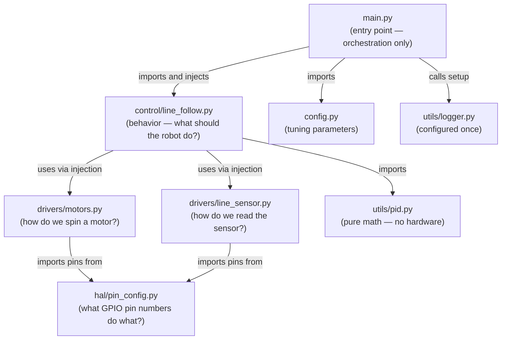
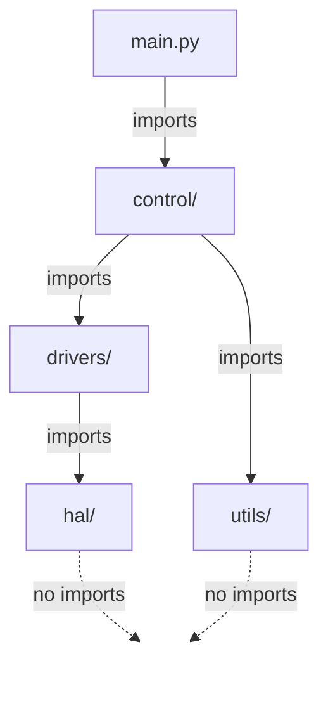

# 🤖 Raspberry Pi Rover Architecture Guide
## Modular Design Using Python on Linux — Line Following Rover Reference Design

> **Super Big Disclaimer** — This was prompted and generated with ChatGPT, then briefly reviewed by Jim The STEAM Clown, and then passed to Claude to update, revise, tune, and recommend additions, then the AI documentation rules were applied. BUT, and this is a BIG BUT, I have not yet really reviewed this to be accurate or even what I want. That will take the Summer 2026, while I am revamping my Python / Rover curriculum.

---

> *"The goal of good architecture is not to write code that works once — it's to write code that a teammate can understand, a student can learn from, and a robot can run reliably for years."*

---

## 📋 Table of Contents

| Section | Title |
|---|---|
| [Section 0](#-section-0--the-problem-with-one-big-file) | The Problem With One Big File |
| [Section 1](#-section-1--overview) | Overview |
| [Section 2](#-section-2--why-python-modules-instead-of-hcpp-pairs) | Why Python Modules Instead of .h/.cpp Pairs |
| [Section 3](#-section-3--the-hal-layer) | The HAL Layer |
| [Section 4](#-section-4--the-drivers-layer) | The Drivers Layer |
| [Section 5](#-section-5--the-control-layer) | The Control Layer |
| [Section 6](#-section-6--the-utils-layer--pidpy) | The Utils Layer — pid.py |
| [Section 6B](#-section-6b--utilsloggerpy--centralized-logging) | utils/logger.py — Centralized Logging |
| [Section 7](#-section-7--mainpy--the-entry-point) | main.py — The Entry Point |
| [Section 8](#-section-8--python-package-structure--__init__py-deep-dive) | Python Package Structure |
| [Section 9](#-section-9--requirementstxt-and-environment-management) | requirements.txt and Environment Management |
| [Section 9B](#-section-9b--reading-python-error-messages) | Reading Python Error Messages |
| [Section 10](#-section-10--the-build--run-flow) | The Build / Run Flow |
| [Section 10B](#-section-10b--testing-without-hardware) | Testing Without Hardware |
| [Section 11](#-section-11--key-design-rules--deep-dive) | Key Design Rules — Deep Dive |
| [Section 12](#-section-12--linux-specific-considerations) | Linux-Specific Considerations |
| [Section 13](#-section-13--common-student-mistakes) | Common Student Mistakes |
| [Section 14](#-section-14--learning-progression) | Learning Progression |
| [Section 15](#-section-15--quick-reference-table) | Quick Reference Table |
| [Section 16](#-section-16--summary-and-final-insight) | Summary and Final Insight |
| [Sources](#-sources-and-references) | Sources and References |

---

## 🗺️ Python / Linux Equivalents at a Glance

Before we dive in, here is the complete mapping between Arduino/C++ concepts and their Python/Linux equivalents. This guide teaches every row in this table.

| Arduino / C++ Concept | Python / Linux Equivalent Used in This Guide |
|---|---|
| `.ino` entry point | `main.py` — the single entry point script |
| `.h` header file (declaration) | Python module `.py` with a class — public interface defined by naming convention and `__all__` |
| `.cpp` implementation file | The **same** Python module file — declaration and implementation are together |
| `#include "file.h"` | `from drivers.motors import MotorDriver` — Python import with package path |
| Include guard (`#ifndef`) | Not needed — Python's import system caches modules automatically |
| `extern const uint8_t PIN = 5` | `hal/pin_config.py` with `MOTOR_LEFT_PWM = 17` (ALL_CAPS convention) |
| `pins.h` / `pins.cpp` split | A single `hal/pin_config.py` — no split needed (module caching prevents multiple definitions) |
| `/drivers/*.cpp` | `/drivers/motors.py`, `/drivers/line_sensor.py` — Python classes with `__init__`, `setup()`, hardware methods |
| `/control/*.cpp` | `/control/line_follow.py` — imports driver classes, implements behavior |
| `/utils/pid.cpp` | `/utils/pid.py` — pure Python `PIDController` class, no hardware imports |
| `static` local variable | Python instance variable (`self._prev_error`) |
| `constrain(val, min, max)` | `max(min_val, min(max_val, val))` or `numpy.clip()` |
| `analogWrite` / PWM | `gpiozero.PWMOutputDevice` with `lgpio` backend |
| `analogRead` | MCP3008 over SPI via `gpiozero.MCP3008` — Pi has **no** built-in ADC |
| `Serial.begin()` | Python `logging` module — `print()` is the beginner trap |

---

## ⚠️ Section 0 — The Problem With One Big File

### Everyone Starts Here — And That's Okay

Let's start with the truth: every programmer who has ever built a robot started exactly where you probably are right now — with one file that does everything. You write it fast, it runs, the rover moves, and you feel great. That feeling is real and it's earned. The code works.

But then something happens. Maybe you want to try a different sensor. Maybe a teammate needs to add obstacle avoidance. Maybe you rewired the motor driver and now you're hunting through 200 lines of code trying to find every place you wrote pin number `17`. The "one big file" stops feeling clever and starts feeling like a trap.

This section shows you that trap in full. The code below is **real, working code**. It will run on your Pi 5. It follows a line. But it is also a small architectural disaster — and we're going to walk through exactly why, line by line.

---

### rover_bad.py — A Working File With Hidden Problems

Read through this file carefully. Every `⚠️` comment marks a structural violation. The logic is fine — the *organization* is the problem.

```python
# rover_bad.py
# A working line-follower — but every ⚠️ marks an architectural problem.
# This is where everyone starts. The goal of this guide is to show you
# where to go next.

import time
import signal
from gpiozero import PWMOutputDevice, DigitalOutputDevice
from gpiozero.pins.lgpio import LGPIOFactory
from gpiozero import Device

# ⚠️ VIOLATION: Pin numbers hardcoded directly here, at the top of the
# behavior file. If you rewire the robot, you must hunt through THIS file.
# What if pin 17 appears in three different places? Which one did you miss?
Device.pin_factory = LGPIOFactory()

# ⚠️ VIOLATION: Raw integers used as pin numbers with no names.
# What does pin 17 do? You have to read the whole file to figure it out.
# Six months from now, you won't remember.
left_pwm   = PWMOutputDevice(17)   # ⚠️ magic number — what is 17?
left_dir   = DigitalOutputDevice(27)
right_pwm  = PWMOutputDevice(18)   # ⚠️ magic number — what is 18?
right_dir  = DigitalOutputDevice(22)

# ⚠️ VIOLATION: Sensor pin also hardcoded here, mixed in with motor pins.
# There is no boundary between "motor stuff" and "sensor stuff."
from gpiozero import MCP3008
sensor = MCP3008(channel=0)        # ⚠️ channel 0 — meaningful? unclear.

# ⚠️ VIOLATION: PID tuning values hardcoded as bare floats at module level.
# Want to try a different Kp? Ctrl+F through the whole file and hope
# you find all of them. What if Kp appears in a comment AND in the math?
KP = 0.4    # ⚠️ tuning constant buried in behavior file
KI = 0.02   # ⚠️ should be in a config file, separate from hardware
KD = 0.1    # ⚠️ a teammate tuning PID shouldn't need to see pin numbers

BASE_SPEED = 0.5   # ⚠️ behavior parameter mixed with hardware setup
MAX_SPEED  = 0.8   # ⚠️ these belong in a config file, not here

# ⚠️ VIOLATION: PID state variables floating loose at module level.
# These are global mutable state — the hardest kind of bug to track down.
# If two functions both touch _integral, which one is "right"?
_prev_error = 0.0
_integral   = 0.0
_last_time  = time.time()

def read_sensor() -> float:
    # ⚠️ VIOLATION: Hardware interaction buried inside what looks like
    # a simple math function. There is no layer boundary here.
    raw = sensor.value          # reads hardware
    position = (raw - 0.5) * 2.0  # maps 0–1 to -1.0–+1.0
    return position

def compute_pid(error: float) -> float:
    # ⚠️ VIOLATION: PID math uses global state variables.
    # This function cannot be tested without the globals being set up.
    # It cannot be reused in another project without copy-pasting globals too.
    global _prev_error, _integral, _last_time   # ⚠️ global state — fragile

    now = time.time()
    dt = now - _last_time
    if dt <= 0:
        dt = 0.001

    _integral  += error * dt
    _integral   = max(-1.0, min(1.0, _integral))  # anti-windup
    derivative  = (error - _prev_error) / dt
    output      = KP * error + KI * _integral + KD * derivative

    _prev_error = error
    _last_time  = now
    return output

def set_motors(left: float, right: float) -> None:
    # ⚠️ VIOLATION: Motor hardware control mixed into the same file as
    # PID math and sensor reading. Which "layer" does this belong to?
    # Answer: all three — and that's exactly the problem.
    left  = max(-1.0, min(1.0, left))
    right = max(-1.0, min(1.0, right))

    # ⚠️ VIOLATION: Direction logic embedded here with no abstraction.
    # A teammate working on PID tuning now has to understand H-bridge logic.
    left_dir.value  = 1 if left  >= 0 else 0
    right_dir.value = 1 if right >= 0 else 0
    left_pwm.value  = abs(left)
    right_pwm.value = abs(right)

def cleanup() -> None:
    # ⚠️ VIOLATION: Cleanup scattered throughout the file.
    # If you add a new hardware device, you must remember to add it here.
    # There is no class to own this responsibility automatically.
    left_pwm.close()
    left_dir.close()
    right_pwm.close()
    right_dir.close()
    sensor.close()

running = True

def handle_signal(sig, frame):
    global running
    running = False

signal.signal(signal.SIGINT, handle_signal)

# ⚠️ VIOLATION: The main loop is not guarded by if __name__ == "__main__".
# If another file ever imports this module (say, for testing), this loop
# runs immediately. The robot starts moving the moment you import the file.
print("Rover starting...")    # ⚠️ print() — no timestamp, no log level,
                               # no way to filter, no file output.
try:
    while running:
        position = read_sensor()
        correction = compute_pid(position)
        left_speed  = BASE_SPEED - correction
        right_speed = BASE_SPEED + correction
        set_motors(left_speed, right_speed)
        time.sleep(0.02)
finally:
    cleanup()
    print("Rover stopped.")   # ⚠️ print() again — this is not logging.
```

---

### Violation Inventory

Here are the questions a teammate would ask when they open `rover_bad.py` for the first time:

| Question | Problem |
|---|---|
| "Where do I change the pin number if I rewire?" | It's in the middle of the file, mixed with PID math and sensor logic. There's no single place to look. |
| "Where does the PID math end and the motor control begin?" | There's no boundary. Both live in the same flat namespace. |
| "Can I test the PID math without running the motor?" | No. The PID function uses global variables. You can't instantiate it cleanly. |
| "Can I run any of this on my laptop to check the logic?" | No. Hardware imports run at module level. Import the file and the Pi GPIO pins activate. |
| "If I want to add a second sensor, where does it go?" | Anywhere. Which means: nowhere obvious. Every addition makes the file longer and more confusing. |
| "What does `channel=0` mean for the sensor?" | You'd have to look up MCP3008 pin assignments. A named constant like `LINE_SENSOR_CHANNEL = 0` would tell you immediately. |
| "What is pin 17?" | A mystery. You'll have to trace the whole file to figure out it's the left motor PWM pin. |

---

### The Promise

By the time you finish this guide, you will be able to:

- **Rewire your robot** by editing exactly one file — `hal/pin_config.py` — and changing nothing else.
- **Tune PID gains** by editing exactly one file — `config.py` — without touching sensor code, motor code, or anything else.
- **Test your control logic on a laptop** — no Pi required — using mock driver objects that simulate the hardware interface.
- **Show any single file to a teammate** and have them understand its complete responsibility without reading any other file.
- **Add a new sensor or behavior** in a new file, without touching any existing file that is already working.

That's not magic. That's architecture. Let's build it.

---

## 🧭 Section 1 — Overview

### From "It Works on My Pi" to Professional Robotics Code

You are at a turning point. You've written Python scripts that make hardware do things — blink LEDs, spin motors, read sensors. That is genuinely hard, and you should be proud of it. But there's a gap between "code that works" and "code that a team can build on," and that gap is architecture.

Think of it this way: a single-file script is like a workshop where every tool is thrown on the floor. You can find your hammer eventually, and the work still gets done. But when you need to hand the workshop to someone else, or when you need to find the hammer at 11pm when everything is broken, the floor-full-of-tools model fails. A modular architecture is the pegboard — every tool has a labeled home, and anyone walking in can find what they need in under ten seconds.

This guide uses a differential drive rover running a line-following behavior as the concrete example throughout. Why line following? Because it's complex enough to require a real PID controller, real sensor reading, and real motor control — but simple enough that the behavior itself doesn't distract from the architecture lesson. The robot follows a line. What we're really teaching is *how to organize the code that makes it follow the line*.

The structure you'll build in this guide directly parallels industry practice. ROS 2, the Robot Operating System used in professional and research robotics, organizes code into nodes that are exactly analogous to the layers you'll build here — each node has a single responsibility, communicates through defined interfaces, and can be tested independently. You're not learning a toy structure. You're learning the real one, scaled to a single-board computer.

By the end of this guide, you will have a complete, runnable project with the following layered structure:



Every arrow in this diagram is intentional. Every missing arrow is equally intentional. The control layer does not touch hardware. The drivers do not implement behavior. The HAL does not contain logic. You will understand why each of those rules exists — and feel the consequences of breaking them — by the time you reach Section 11.

### Project Directory Structure

Before we look at what goes *inside* each file, let's get the full picture of where everything lives. Every file in this project has an address, and that address tells you its layer, its responsibility, and its rules before you even open it.

```text
rover_line_follow/                  ← project root (run all commands from here)
│
├── main.py                         ← entry point only — no logic lives here
├── config.py                       ← tunable parameters: PID gains, speeds, thresholds
│
├── control/                        ← BEHAVIOR layer: "what should the robot do?"
│   ├── __init__.py                 ← marks directory as a Python package
│   └── line_follow.py              ← LineFollower class — PID-based line tracking
│
├── drivers/                        ← HARDWARE layer: "how do we talk to this device?"
│   ├── __init__.py
│   ├── motors.py                   ← MotorDriver class — PWM + direction control
│   └── line_sensor.py              ← LineSensorDriver class — MCP3008 ADC reads
│
├── hal/                            ← HARDWARE ABSTRACTION layer: "what pin is what?"
│   ├── __init__.py
│   └── pin_config.py               ← ALL GPIO BCM pin numbers live here. Only here.
│
├── utils/                          ← UTILITIES layer: reusable, hardware-free code
│   ├── __init__.py
│   ├── pid.py                      ← PIDController class — pure math, no hardware
│   └── logger.py                   ← centralized logging setup — call once in main.py
│
├── tests/                          ← TESTS: run on any laptop, no hardware needed
│   ├── __init__.py
│   ├── test_pid.py                 ← unit tests for PID math
│   └── test_line_follow.py         ← behavior tests using mock drivers
│
├── .env                            ← runtime overrides (log level, mode) — not in Git
├── .gitignore                      ← excludes venv/, __pycache__/, .env, logs
├── requirements.txt                ← pinned runtime dependencies (for Pi deployment)
├── requirements-dev.txt            ← dev/test dependencies (pytest, python-dotenv)
└── README.md                       ← project overview and setup instructions
```

Notice the pattern: every subdirectory is a **layer**, and every layer has a single-word answer to the question "what does this layer know about?" The `hal/` layer knows about pins. The `drivers/` layer knows about hardware devices. The `control/` layer knows about behavior. The `utils/` layer knows about algorithms. `main.py` knows how to connect them all. Nothing else.

---

## 🧠 Section 2 — Why Python Modules Instead of .h/.cpp Pairs

### The Most Important Conceptual Section for Students Coming From Arduino

If you've worked through the companion Arduino architecture guide, you know that C++ splits every "unit of code" into two files: a header (`.h`) that declares what a module offers, and an implementation (`.cpp`) that defines how it works. The header is a contract — it tells the compiler and your teammates exactly what functions exist, what they accept, and what they return. You cannot use a function you haven't declared.

Python doesn't work this way at all. There is no compilation step, no linker, and no header files. A Python module (a `.py` file) is simultaneously its own declaration and its own implementation. When you write a class in `motors.py`, that class IS the public interface — there's no separate "motors.h" listing what it offers. This might sound simpler, and in some ways it is. But it also means Python puts the burden on you, the programmer, to maintain discipline that C++ enforces with a compiler. C++ will refuse to compile if you call a function that isn't declared. Python will run happily until it hits the missing function at runtime — and then crash.

This is the fundamental tradeoff: Python gives you flexibility and speed, and asks for discipline in return. The rest of this section teaches you exactly what that discipline looks like.

---

### The Implicit Contract — Public and Private Methods

In C++, a header file makes the contract explicit. If a method isn't in the `.h` file, it doesn't exist as far as anyone else is concerned. Python has no such enforcement — but it has a strong convention that every Python programmer knows and follows.

In Python, any method or attribute whose name starts with a single underscore (`_`) is considered **private** — it's for internal use only. Any method without the underscore is **public** — it's part of the interface that other modules can rely on. This isn't enforced by the language; Python won't stop you from calling `motors._internal_calculation()` from another file. But doing so is considered bad practice, and your teammates (and future you) will judge you for it.

Think of it like the difference between a restaurant's dining room and its kitchen. The dining room menu is the public interface — it's what customers see and can order from. The kitchen's internal prep work is private — the customer doesn't need to know how the sauce is made, and the restaurant doesn't want them wandering back there. A method named `set_speed()` is the dining room. A method named `_calculate_pwm_duty_cycle()` is the kitchen.

```python
class MotorDriver:
    # Public method — part of the interface. 
    # Other modules SHOULD call this.
    def set_speed(self, left: float, right: float) -> None:
        self._apply_direction(left, right)   # calls a private method internally
        self._apply_pwm(left, right)

    # Private method — internal implementation detail.
    # Other modules should NOT call this directly.
    # The underscore is a signal: "this is kitchen, not dining room."
    def _apply_direction(self, left: float, right: float) -> None:
        ...

    def _apply_pwm(self, left: float, right: float) -> None:
        ...
```

---

### `__all__` — Making the Public API Explicit

Python gives you a tool called `__all__` that lets you explicitly declare what a module exports. When you write `from drivers.motors import *`, Python will only import the names listed in `__all__`. More importantly, `__all__` serves as a documentation tool: anyone reading your module can look at `__all__` and immediately know what the public API is, without reading the entire file.

```python
# drivers/motors.py

# This is the explicit declaration of this module's public API.
# It mirrors what a C++ header file does — but here it's opt-in, not required.
__all__ = ["MotorDriver"]

class MotorDriver:
    ...
```

You don't *have* to use `__all__`. But for a module that is meant to be a stable interface — like a driver — it's good practice. It tells teammates: "This is what I offer. Everything else is internal."

---

### `if __name__ == "__main__":` — The Module Import Guard

Every Python module has a special variable called `__name__`. When you run a file directly (`python3 main.py`), Python sets `__name__` to `"__main__"`. When another file imports a module (`from drivers.motors import MotorDriver`), Python sets `__name__` to the module's import path (e.g., `"drivers.motors"`).

This distinction is critically important. Without the `if __name__ == "__main__":` guard, any code at the top level of a file runs the moment that file is imported — not just when it's run directly. That means if you put your main loop in `rover_bad.py` without the guard, importing that file for testing would start the rover moving. With the guard, code inside that block only runs when the file is executed directly.

```python
# main.py

def start_rover():
    ...  # rover startup logic

# This block ONLY runs when you type: python3 main.py
# It does NOT run when another file imports from this module.
# This is the equivalent of Arduino's main() entry point.
if __name__ == "__main__":
    start_rover()
```

Module files (drivers, control, utils) should **never** have code at the top level that runs on import. Instantiating hardware, starting loops, printing output — all of that must be inside `if __name__ == "__main__":` or inside class methods.

---

### The Python Import System — How It Works Under the Hood

When Python sees `from drivers.motors import MotorDriver`, it does the following:

1. Looks for a directory named `drivers` in the Python path (starting from the project root).
2. Checks that `drivers/` contains an `__init__.py` file — this is what makes it a **package** rather than just a folder.
3. Looks inside `drivers/` for a file named `motors.py`.
4. Executes `motors.py` **once** and stores the result in a module cache (`sys.modules`).
5. Extracts the name `MotorDriver` from that cached module.

The critical word in step 4 is **once**. No matter how many files import `drivers.motors`, Python only ever executes `motors.py` a single time. This is called **module caching**, and it is the mechanism that makes Python's architecture fundamentally different from C++.

---

### Why Python Doesn't Need `extern` — The Module Caching Contrast

This is the most important C++ contrast in this entire guide, and it deserves a full explanation.

In C++, when you want a constant like `const uint8_t MOTOR_LEFT_PWM = 17` to be accessible from multiple files, you face a problem: if you define it in a `.h` header and that header gets `#include`'d by ten different `.cpp` files, the compiler creates ten separate copies of the variable — one in each compilation unit. The linker then complains about multiple definitions. The solution is `extern`: you *declare* the variable in the `.h` file (`extern const uint8_t MOTOR_LEFT_PWM;`) and *define* it exactly once in a `.cpp` file (`const uint8_t MOTOR_LEFT_PWM = 17;`). This is why C++ needs two files for a constants module.

Python doesn't have this problem at all. When `pin_config.py` is imported by `motors.py` and also by `line_sensor.py`, Python doesn't create two copies of the constants. It runs `pin_config.py` once, stores the result in `sys.modules["hal.pin_config"]`, and every subsequent import gets a reference to the **same object**. There is one copy. There is no multiple-definition problem. There is no `extern`.

This is why `hal/pin_config.py` can be a single file instead of two. Not because Python is lazier — because Python's import system solves the underlying problem by a completely different mechanism. C++ solves it at link time with `extern`. Python solves it at runtime with module caching.

| Problem | C++ Solution | Python Solution |
|---|---|---|
| Multiple files need the same constant | `extern` in `.h`, define in `.cpp` | Module cached in `sys.modules` — one file is enough |
| Prevent multiple definitions | Include guards (`#ifndef`) | Automatic — module only executes once |
| Know what a module offers | Read the `.h` header file | Read `__all__` or look at public methods |
| Catch wrong function names early | Compile-time error | Runtime `AttributeError` — must be caught by testing |

---

### Circular Imports — Python's Version of Include Errors

In C++, circular includes (file A includes file B, file B includes file A) cause compilation to fail. Python has a similar problem called **circular imports**, and they're sneaky because Python won't always catch them immediately.

If `control/line_follow.py` imports from `drivers/motors.py`, AND `drivers/motors.py` imports from `control/line_follow.py`, you have a circular import. Python will try to execute both modules, but when it reaches the second import before the first has finished executing, it gets a partially-initialized module — and the import fails with a confusing error.

The fix is simple and structural: dependencies flow in one direction only. In this project:



If you ever find yourself wanting to import a `control` module from inside a `driver` module, that's a signal that your architecture has a problem — not your import statement.

---

## 📍 Section 3 — The HAL Layer

### hal/pin_config.py and config.py — Two Constants Files With Different Jobs

The Hardware Abstraction Layer (HAL) has one job: be the single source of truth for your robot's physical wiring. Every GPIO pin number in the entire project lives in exactly one file: `hal/pin_config.py`. No exceptions.

But before we write that file, we need to draw a distinction that trips up almost every student: **pin numbers and tuning parameters are different things, and they belong in different files**.

`pin_config.py` answers the question: "What physical pin is connected to what device?" This is a hardware question. The answer changes when you rewire the robot.

`config.py` answers the question: "How should the robot behave?" This is a software question. The answer changes when you tune the PID controller, adjust speeds, or change sensor thresholds.

A teammate who is tuning PID gains should never need to open `pin_config.py`. A teammate who is rewiring the motor driver should never need to open `config.py`. Keep them separate, and each file stays small, focused, and easy to understand.

---

### Why One File Is Enough — The Module Caching Contrast Revisited

Remember from Section 2: in C++, you need `pins.h` + `pins.cpp` + `extern` because the compiler creates a separate copy of each constant in every translation unit that includes the header. Python doesn't do this. When `drivers/motors.py` imports `hal/pin_config.py`, and `drivers/line_sensor.py` also imports `hal/pin_config.py`, Python runs `pin_config.py` exactly once and hands both drivers a reference to the same module object. There is one set of constants. There is no duplication. There is no `extern` needed.

This isn't Python being less rigorous — it's Python solving the multiple-definition problem through a completely different mechanism. Once you understand module caching, the one-file approach is obviously correct.

---

### Python Has No `const` — Three Approaches to Immutability

Python doesn't have a `const` keyword. There is no language feature that prevents you from writing `pin_config.MOTOR_LEFT_PWM = 99` somewhere and corrupting your pin configuration. You have three tools to enforce immutability, in order from simplest to strongest:

**Approach 1: ALL_CAPS Convention (Simple, Conventional)**

This is the most common Python approach. Constants are module-level variables named in `ALL_CAPS`. The language doesn't enforce immutability, but every Python programmer knows that touching an ALL_CAPS variable is forbidden. The convention IS the contract.

```python
# hal/pin_config.py — Approach 1: ALL_CAPS convention
# This is the simplest and most Pythonic approach for most projects.

# Motor driver pins (BCM numbering — NOT board/physical pin numbers)
MOTOR_LEFT_PWM     = 17   # left motor PWM speed control
MOTOR_LEFT_DIR     = 27   # left motor direction (HIGH = forward)
MOTOR_RIGHT_PWM    = 18   # right motor PWM speed control
MOTOR_RIGHT_DIR    = 22   # right motor direction (HIGH = forward)

# Line sensor (analog via MCP3008 SPI ADC)
LINE_SENSOR_CHANNEL = 0   # MCP3008 channel 0 (channel number, not GPIO pin)
LINE_SENSOR_SPI_BUS = 0   # SPI bus 0 (SPI0 on Pi 5)
LINE_SENSOR_SPI_DEV = 0   # SPI device 0 (CE0)

# Ultrasonic distance sensor
ULTRASONIC_TRIGGER  = 23  # trigger pin (output)
ULTRASONIC_ECHO     = 24  # echo pin (input)

# Encoder pins (for future odometry)
ENCODER_LEFT_A      = 5   # left encoder channel A (interrupt-capable)
ENCODER_LEFT_B      = 6   # left encoder channel B
ENCODER_RIGHT_A     = 13  # right encoder channel A
ENCODER_RIGHT_B     = 19  # right encoder channel B

# Status LED
STATUS_LED          = 4   # onboard status indicator LED
```

**Approach 2: `types.SimpleNamespace` (Grouped, Readable)**

When you have many pin groups, `SimpleNamespace` lets you organize them logically and access them with dot notation: `pins.motor.left_pwm`. It's still not truly immutable, but it makes the structure clearer.

```python
# hal/pin_config.py — Approach 2: SimpleNamespace for grouping
import types

# Group related pins under namespaces for readability.
# Access as: pins.motor.left_pwm, pins.sensor.channel
pins = types.SimpleNamespace(
    motor=types.SimpleNamespace(
        left_pwm  = 17,
        left_dir  = 27,
        right_pwm = 18,
        right_dir = 22,
    ),
    sensor=types.SimpleNamespace(
        channel = 0,
        spi_bus = 0,
        spi_dev = 0,
    ),
    ultrasonic=types.SimpleNamespace(
        trigger = 23,
        echo    = 24,
    ),
    led=types.SimpleNamespace(
        status = 4,
    ),
)
```

**Approach 3: `@dataclass(frozen=True)` (Truly Immutable)**

This approach gives you actual runtime enforcement. Attempting to change any field of a frozen dataclass raises a `FrozenInstanceError`. This is the strongest protection and is recommended when you want the language to enforce your architecture rules.

```python
# hal/pin_config.py — Approach 3: frozen dataclass (truly immutable)
from dataclasses import dataclass

@dataclass(frozen=True)
class MotorPins:
    left_pwm:  int = 17
    left_dir:  int = 27
    right_pwm: int = 18
    right_dir: int = 22

@dataclass(frozen=True)
class SensorPins:
    channel: int = 0
    spi_bus: int = 0
    spi_dev: int = 0

@dataclass(frozen=True)
class PinConfig:
    motor:  MotorPins  = MotorPins()    # nested frozen dataclass
    sensor: SensorPins = SensorPins()
    ultrasonic_trigger: int = 23
    ultrasonic_echo:    int = 24
    status_led:         int = 4

# Single module-level instance — import this object, not the class.
# Attempting to write PIN_CONFIG.motor.left_pwm = 99 will raise FrozenInstanceError.
PIN_CONFIG = PinConfig()
```

For this guide, **Approach 1 (ALL_CAPS)** is the default in all code examples. Approach 3 is introduced as the "professional" option when immutability matters.

---

### BCM vs Board Numbering — Use BCM Always

The Raspberry Pi has two GPIO numbering systems. **Board numbering** uses the physical pin position on the 40-pin header (1 through 40). **BCM numbering** uses the Broadcom chip's internal GPIO numbers (which don't match the physical positions).

Always use **BCM numbering** in your code. Here's why:

- `gpiozero` defaults to BCM numbering
- `lgpio` uses BCM numbering
- BCM numbers appear in Pi documentation, GPIO diagrams, and every tutorial you'll find
- Board numbers change meaning if you use a different Pi model; BCM numbers don't

When you write `MOTOR_LEFT_PWM = 17`, that `17` is BCM 17 — which is physical pin 11 on the 40-pin header. Do not confuse them.

The Pi 5 uses the `lgpio` backend for `gpiozero` (replacing the older `RPi.GPIO`). You must configure this at the top of every driver file that uses `gpiozero`:

```python
# This MUST appear before any gpiozero Device is instantiated.
# lgpio is the correct backend for Raspberry Pi 5.
# Without this line, gpiozero may select the wrong backend and fail.
from gpiozero.pins.lgpio import LGPIOFactory
from gpiozero import Device
Device.pin_factory = LGPIOFactory()
```

---

### config.py — Tunable Parameters, Not Pins

Here is `config.py`, the sibling of `pin_config.py` with a completely different job. Note that it imports nothing from `hal` — it has zero knowledge of hardware.

```python
# config.py
# Tunable behavior parameters for the line-following rover.
# 
# THIS FILE IS FOR TUNING — not for wiring.
# If you are changing a pin number, you are in the wrong file.
# If you are tuning PID gains, you are in the right place.
#
# This file uses @dataclass(frozen=True) to make all values immutable
# at runtime — you cannot accidentally overwrite a config value.

from dataclasses import dataclass, field
import os

@dataclass(frozen=True)
class PIDConfig:
    """PID controller tuning gains. Adjust these to tune rover tracking."""
    kp: float = 0.40    # proportional gain — how hard to correct NOW
    ki: float = 0.02    # integral gain — how hard to correct ACCUMULATED error
    kd: float = 0.10    # derivative gain — how hard to correct RATE of error change
    integral_clamp: float = 1.0   # anti-windup: maximum integral accumulation

@dataclass(frozen=True)
class SpeedConfig:
    """Speed limits for the rover. Values are 0.0–1.0 (fraction of max PWM)."""
    base:  float = 0.50    # straight-line cruising speed
    max:   float = 0.80    # maximum allowed wheel speed (safety limit)
    min:   float = 0.10    # minimum speed when turning (prevent stall)

@dataclass(frozen=True)
class SensorConfig:
    """Line sensor reading configuration."""
    center_threshold: float = 0.05   # readings within ±0.05 treated as "centered"
    lost_line_value:  float = 0.0    # value returned when line is lost

@dataclass(frozen=True)
class LoopConfig:
    """Main control loop timing."""
    update_hz:   float = 50.0        # target control loop frequency (Hz)

    @property
    def update_interval(self) -> float:
        """Derived value: seconds per loop iteration."""
        # Computed from update_hz — not stored separately to avoid mismatch.
        return 1.0 / self.update_hz

@dataclass(frozen=True)
class RoverConfig:
    """Top-level configuration object. Import this from config.py."""
    pid:    PIDConfig   = field(default_factory=PIDConfig)
    speed:  SpeedConfig = field(default_factory=SpeedConfig)
    sensor: SensorConfig = field(default_factory=SensorConfig)
    loop:   LoopConfig  = field(default_factory=LoopConfig)
    log_level: str = "INFO"   # can be overridden by .env file

# The single config instance for the entire project.
# Import this: from config import CONFIG
CONFIG = RoverConfig()
```

### Level Up: Loading `.env` Overrides (Optional)

For advanced use, you can let a `.env` file override config values without editing source code. This is useful when you want to switch between "debug mode" (verbose logging, slow speed) and "competition mode" (fast, minimal logging) without code changes.

```python
# At the top of config.py, BEFORE defining CONFIG:
# pip install python-dotenv (add to requirements-dev.txt)
import os
from dotenv import load_dotenv

load_dotenv()   # reads .env file from project root if it exists

# Then use os.getenv() with a default fallback:
# log_level: str = os.getenv("ROVER_LOG_LEVEL", "INFO")
```

A `.env` file would look like:
```bash
ROVER_LOG_LEVEL=DEBUG
```

The `.env` file is **never committed to Git** — add it to `.gitignore`. It stays on your Pi and never touches your source code.

### What NEVER Belongs in pin_config.py

This is a hard rule, not a suggestion:

- ❌ No `import gpiozero` — pin_config.py imports nothing
- ❌ No `GPIO.setup()` calls — no hardware initialization
- ❌ No PID gains, speed values, or thresholds — those go in `config.py`
- ❌ No functions, classes, or logic of any kind
- ✅ Only module-level constants (integers, strings, or frozen dataclasses)

If `pin_config.py` contains a function or an import statement, the architecture is already broken.

---

## 🔌 Section 4 — The Drivers Layer

### drivers/motors.py and drivers/line_sensor.py

A driver has one job: translate abstract commands into hardware operations. The control layer says "go left at 60% speed." The driver translates that into GPIO pin states and PWM duty cycles. The control layer never needs to know what a PWM duty cycle is. The driver never needs to know why it's being asked to go left.

Think of a driver like an electrical outlet adapter when traveling internationally. The device (your laptop) doesn't know or care whether it's plugged into a US outlet or a European one. The adapter (the driver) handles the translation. Your laptop just says "I need power" — it doesn't say "please apply 120V AC at 60Hz."

The driver layer is where hardware knowledge lives. Only drivers import `gpiozero`, `lgpio`, or `spidev`. Only drivers import from `hal/pin_config.py`. Every other layer in the project is hardware-blind.

---

### The Raspberry Pi Has No Analog-to-Digital Converter (ADC)

Before we write the sensor driver, you need to know one critical difference between Arduino and Raspberry Pi: **the Pi has no built-in analog input pins.** Arduino's `analogRead()` connects directly to an internal ADC. The Pi's GPIO pins are digital only — HIGH or LOW. If your line sensor outputs an analog voltage, you need an external ADC chip.

The most common solution is the **MCP3008** — an 8-channel, 10-bit ADC that connects to the Pi over SPI. `gpiozero` includes a built-in `MCP3008` class that handles the SPI communication for you. Alternatively, many line sensor arrays output digital signals (a threshold comparison), in which case you can read them directly as `DigitalInputDevice`.

This guide shows both approaches in the sensor driver. The MCP3008 approach handles analog sensors; the digital approach handles sensors with built-in comparators.

---

### The Three-Step Rule for Driver Methods

Every driver method follows three steps:

1. **Accept abstract values** — `set_speed(left: float, right: float)` receives values in the range -1.0 to +1.0. Not PWM integers. Not voltage levels. Abstract normalized values.
2. **Translate to hardware terms** — Convert those abstract values to whatever the hardware needs (PWM duty cycle 0.0–1.0, direction bit HIGH/LOW).
3. **Apply hardware constraints** — Clamp values to safe ranges, apply minimum thresholds, enforce safety limits.

The control layer uses step 1's interface. It never sees steps 2 or 3.

---

### Full Annotated drivers/motors.py

```python
# drivers/motors.py
# Motor driver for a differential drive rover using an H-bridge motor controller.
# 
# This module is responsible for ONE thing: translating abstract speed commands
# (-1.0 to +1.0) into GPIO pin states and PWM duty cycles.
#
# LAYER RULES (enforced by convention, not by Python):
#   ✅ MAY import from: hal.pin_config, gpiozero, lgpio
#   ❌ MUST NOT import from: control/, config.py (behavior constants)
#   ❌ MUST NOT implement behavior logic (decisions about when/why to move)

from __future__ import annotations   # enables forward references in type hints

import logging

# Import the lgpio backend BEFORE importing any gpiozero Device classes.
# This is required on Raspberry Pi 5 — the default backend is not lgpio.
from gpiozero.pins.lgpio import LGPIOFactory
from gpiozero import Device, PWMOutputDevice, DigitalOutputDevice

# Import pin constants by name — NEVER use raw integers in a driver file.
# "Remember that raw pin number in rover_bad.py? Here is where it now lives."
from hal.pin_config import (
    MOTOR_LEFT_PWM,
    MOTOR_LEFT_DIR,
    MOTOR_RIGHT_PWM,
    MOTOR_RIGHT_DIR,
)

# Get a module-level logger. This module does NOT call logging.basicConfig().
# Logging is configured once in main.py via utils/logger.py.
logger = logging.getLogger(__name__)

# Set lgpio as the pin factory for all gpiozero devices in this module.
# This call configures the global Device pin factory — do it once per driver file.
Device.pin_factory = LGPIOFactory()

# Declare the public API of this module.
# Only MotorDriver should be imported by other modules.
__all__ = ["MotorDriver"]


class MotorDriver:
    """
    Abstracts a dual H-bridge motor controller for a differential drive rover.

    Speed interface: -1.0 (full reverse) to +1.0 (full forward), 0.0 = stop.
    The caller never needs to know what PWM duty cycle or direction bits mean.
    """

    # Minimum PWM duty cycle before the motor starts moving.
    # Below this threshold, the motor stalls without rotating — which wastes
    # power and can damage the motor driver. This is hardware-specific and
    # belongs here in the driver, not in config.py.
    _MIN_DUTY: float = 0.10

    def __init__(self) -> None:
        """
        Initialize GPIO devices for both motors.
        
        Note: This does not start the motors. All outputs start at 0 (stopped).
        The GPIO devices are created here — hardware is touched at construction time.
        """
        logger.info("Initializing MotorDriver")

        # PWMOutputDevice controls speed via duty cycle (0.0 = off, 1.0 = full speed).
        # initial_value=0 means the motor starts stopped — always safe.
        self._left_pwm  = PWMOutputDevice(MOTOR_LEFT_PWM,  initial_value=0)
        self._left_dir  = DigitalOutputDevice(MOTOR_LEFT_DIR,  initial_value=False)
        self._right_pwm = PWMOutputDevice(MOTOR_RIGHT_PWM, initial_value=0)
        self._right_dir = DigitalOutputDevice(MOTOR_RIGHT_DIR, initial_value=False)

        # Track internal state for __repr__ and debugging.
        self._left_speed:  float = 0.0
        self._right_speed: float = 0.0
        self._running: bool = False

        logger.debug(
            f"MotorDriver initialized: left_pwm=BCM{MOTOR_LEFT_PWM}, "
            f"right_pwm=BCM{MOTOR_RIGHT_PWM}"
        )

    # ── Public Interface ───────────────────────────────────────────────────────

    def set_speed(self, left: float, right: float) -> None:
        """
        Set motor speeds. Values are normalized: -1.0 to +1.0.
        
        Negative values drive the motor in reverse.
        Zero stops the motor.
        The method handles direction bits and PWM translation internally.
        """
        # Clamp inputs to the valid range. This is a safety constraint —
        # we never trust that the caller has already clamped the values.
        left  = self._clamp(left,  -1.0, 1.0)
        right = self._clamp(right, -1.0, 1.0)

        self._apply_motor(self._left_pwm,  self._left_dir,  left)
        self._apply_motor(self._right_pwm, self._right_dir, right)

        # Store current speeds for debugging and __repr__.
        self._left_speed  = left
        self._right_speed = right
        self._running = (left != 0.0 or right != 0.0)

        logger.debug(f"Motors set: left={left:.2f}, right={right:.2f}")

    def stop(self) -> None:
        """Stop both motors immediately. Always safe to call."""
        self.set_speed(0.0, 0.0)
        logger.info("Motors stopped")

    def cleanup(self) -> None:
        """
        Release all GPIO resources. Call this before the program exits.
        
        Failure to call cleanup() leaves GPIO pins in an undefined state,
        which can cause unexpected behavior on the next run or even damage
        the hardware if pins are left driving current.
        """
        logger.info("MotorDriver cleanup")
        self.stop()               # always stop before releasing GPIO
        self._left_pwm.close()    # release the gpiozero device
        self._left_dir.close()
        self._right_pwm.close()
        self._right_dir.close()

    # ── Context Manager Support ────────────────────────────────────────────────
    # The context manager pattern allows: with MotorDriver() as motors:
    # This guarantees cleanup() is called even if an exception occurs inside
    # the with block. Python has no destructor guarantee (unlike C++) so
    # the context manager is the Pythonic way to ensure resource cleanup.

    def __enter__(self) -> MotorDriver:
        """Called when entering a `with MotorDriver() as motors:` block."""
        return self   # return self so the `as motors` binding works

    def __exit__(self, exc_type, exc_val, exc_tb) -> bool:
        """Called when leaving the with block — even if an exception occurred."""
        self.cleanup()
        # Return False: don't suppress exceptions. Let them propagate normally.
        return False

    # ── Debug Representation ───────────────────────────────────────────────────
    # On Arduino, you'd write Serial.println(motorSpeed) everywhere.
    # In Python, implement __repr__ and print(motor_driver) gives you rich info.
    # This is a Python-specific debugging superpower with no Arduino equivalent.

    def __repr__(self) -> str:
        """Machine-readable representation — useful in the REPL and debugger."""
        return (
            f"MotorDriver("
            f"left_pin=BCM{MOTOR_LEFT_PWM}, "
            f"right_pin=BCM{MOTOR_RIGHT_PWM}, "
            f"left={self._left_speed:.2f}, "
            f"right={self._right_speed:.2f}, "
            f"running={self._running})"
        )

    def __str__(self) -> str:
        """Human-readable representation — used by print()."""
        status = "RUNNING" if self._running else "STOPPED"
        return f"MotorDriver [{status}] L:{self._left_speed:+.2f} R:{self._right_speed:+.2f}"

    # ── Private Implementation ─────────────────────────────────────────────────

    def _apply_motor(
        self,
        pwm: PWMOutputDevice,
        direction: DigitalOutputDevice,
        speed: float,
    ) -> None:
        """
        Apply a single motor command. This is internal — callers use set_speed().
        
        Translates a normalized speed (-1.0 to +1.0) into:
          - A direction bit (True = forward, False = reverse)
          - A PWM duty cycle (0.0 to 1.0)
        
        The minimum duty cycle threshold (_MIN_DUTY) prevents motor stall.
        """
        if speed >= 0:
            direction.value = True      # HIGH = forward direction
        else:
            direction.value = False     # LOW  = reverse direction

        duty = abs(speed)   # duty cycle is always positive (0.0 to 1.0)

        # Apply minimum threshold: if the requested speed is below _MIN_DUTY,
        # the motor won't actually move — just buzzes and wastes power.
        # So we either apply the threshold or stop completely.
        if duty < self._MIN_DUTY and duty > 0:
            duty = self._MIN_DUTY

        pwm.value = duty   # gpiozero accepts 0.0–1.0 directly as duty cycle

    @staticmethod
    def _clamp(value: float, min_val: float, max_val: float) -> float:
        """Clamp value to [min_val, max_val]. Python equivalent of Arduino's constrain()."""
        return max(min_val, min(max_val, value))
```

---

### Full Annotated drivers/line_sensor.py

```python
# drivers/line_sensor.py
# Line sensor driver for analog reflectance sensor via MCP3008 ADC.
#
# The Raspberry Pi 5 has NO built-in ADC (unlike Arduino's analogRead).
# We use an MCP3008 8-channel SPI ADC connected to the Pi's SPI0 bus.
# gpiozero provides a MCP3008 class that handles SPI communication.
#
# Output interface: float from -1.0 (line fully left) to +1.0 (line fully right),
# 0.0 = line centered. The caller never sees raw ADC values.
#
# LAYER RULES:
#   ✅ MAY import from: hal.pin_config, gpiozero, lgpio
#   ❌ MUST NOT import from: control/, config.py

from __future__ import annotations

import logging
from gpiozero.pins.lgpio import LGPIOFactory
from gpiozero import Device, MCP3008

from hal.pin_config import (
    LINE_SENSOR_CHANNEL,
    LINE_SENSOR_SPI_BUS,
    LINE_SENSOR_SPI_DEV,
)

logger = logging.getLogger(__name__)

Device.pin_factory = LGPIOFactory()

__all__ = ["LineSensorDriver"]


class LineSensorDriver:
    """
    Reads a reflectance-based line sensor via MCP3008 SPI ADC.
    
    The MCP3008 returns values from 0.0 (minimum voltage) to 1.0 (maximum voltage).
    We remap this to -1.0 (line is to the left) through 0.0 (centered) to +1.0 (right).
    
    The control layer receives a position float — it never sees ADC counts or voltages.
    """

    def __init__(self) -> None:
        logger.info(
            f"Initializing LineSensorDriver on MCP3008 "
            f"channel={LINE_SENSOR_CHANNEL} spi_bus={LINE_SENSOR_SPI_BUS}"
        )
        # MCP3008 communicates over SPI. gpiozero handles the SPI protocol.
        # channel: which of the 8 MCP3008 inputs to read (0–7)
        # bus and device correspond to SPI0 CE0 on the Pi (the most common setup)
        self._adc = MCP3008(
            channel=LINE_SENSOR_CHANNEL,
            clock_pin=11,   # SPI0 SCLK (BCM 11) — SPI clock
            mosi_pin=10,    # SPI0 MOSI (BCM 10) — Pi sends data to MCP3008
            miso_pin=9,     # SPI0 MISO (BCM 9)  — MCP3008 sends data to Pi
            select_pin=8,   # SPI0 CE0 (BCM 8)   — chip select (active LOW)
        )
        self._last_position: float = 0.0
        logger.debug("LineSensorDriver initialized")

    def read_position(self) -> float:
        """
        Read the line position as a normalized float.
        
        Returns:
            -1.0 = line is fully to the left of center
             0.0 = line is centered under the sensor
            +1.0 = line is fully to the right of center
        
        If the sensor is disconnected or fails, returns the last valid reading
        and logs a warning. The control layer should handle lost-line conditions.
        """
        try:
            # adc.value returns 0.0–1.0. We remap to -1.0–+1.0:
            # 0.0 (ADC min) maps to -1.0 (line hard left)
            # 0.5 (ADC mid) maps to  0.0 (line centered)
            # 1.0 (ADC max) maps to +1.0 (line hard right)
            raw = self._adc.value
            position = (raw - 0.5) * 2.0
            self._last_position = position

            logger.debug(f"Sensor raw={raw:.3f} position={position:.3f}")
            return position

        except Exception as e:
            # Hardware read failed. Log a warning and return last known value.
            # We do NOT raise the exception — a momentary sensor glitch should
            # not crash the control loop. The control layer can decide what to do.
            logger.warning(f"Sensor read failed: {e}. Returning last known position.")
            return self._last_position

    def cleanup(self) -> None:
        """Release SPI GPIO resources."""
        logger.info("LineSensorDriver cleanup")
        self._adc.close()

    def __enter__(self) -> LineSensorDriver:
        return self

    def __exit__(self, exc_type, exc_val, exc_tb) -> bool:
        self.cleanup()
        return False

    def __repr__(self) -> str:
        return (
            f"LineSensorDriver("
            f"channel={LINE_SENSOR_CHANNEL}, "
            f"last_position={self._last_position:.3f})"
        )

    def __str__(self) -> str:
        return f"LineSensorDriver [position={self._last_position:+.3f}]"
```

---

### GPIO Cleanup — Three Patterns

| Pattern | When to Use | Code |
|---|---|---|
| Explicit `cleanup()` call | Simple scripts, fine-grained control | `motors.cleanup()` at program end |
| `try/finally` in main.py | When you don't use context managers | `finally: motors.cleanup()` |
| Context manager (`with`) | **Preferred** — guaranteed cleanup even on crash | `with MotorDriver() as motors:` |

All three are valid. The context manager is most Pythonic because Python does NOT have C++'s destructor guarantee — an object's `__del__` method may never be called, or may be called at an unpredictable time. The `with` statement is the language's explicit, guaranteed cleanup mechanism.

---

## 🧠 Section 5 — The Control Layer

### control/line_follow.py

The control layer is where behavior lives. It answers the question: "Given what the sensors tell me, what should the motors do?" It does NOT know how to talk to hardware. It does NOT know what a PWM duty cycle is. It speaks entirely in terms of driver method calls.

Here's the absolute rule: **if a file inside `control/` contains the words `gpiozero`, `lgpio`, `pigpio`, or `spidev`, the architecture is broken.** No exceptions. No "just this once." Control is hardware-blind.

---

### Dependency Injection — The Chef Analogy

Before we write any code, we need to talk about how the control class gets its tools.

Imagine a chef. A great chef doesn't grow their own vegetables, raise their own chickens, or mill their own flour. That's not their job. Their job is cooking — transforming ingredients into dishes. When they show up to the kitchen, the ingredients are already there, delivered by suppliers. The chef accepts the ingredients and gets to work.

`LineFollower` is the chef. `MotorDriver` is the vegetable supplier. `LineSensorDriver` is the egg supplier. The `LineFollower` class should **accept** these objects when it's created — not build them internally.

Here's the **wrong way** (anti-pattern):

```python
# ❌ WRONG — control class creates its own drivers
class LineFollower:
    def __init__(self) -> None:
        # BAD: LineFollower is now responsible for constructing hardware objects.
        # You cannot test LineFollower without real GPIO hardware being present.
        # You cannot swap in a MockMotorDriver for testing.
        # If MotorDriver's __init__ changes, LineFollower breaks.
        self._motors  = MotorDriver()    # ← hardcoded dependency
        self._sensor  = LineSensorDriver()  # ← can't be replaced
```

Here's the **right way** (dependency injection):

```python
# ✅ CORRECT — control class receives its drivers from outside
class LineFollower:
    def __init__(self, motor_driver, sensor_driver, pid_controller) -> None:
        # GOOD: LineFollower receives its tools. It doesn't care if they're
        # real hardware drivers or mock objects for testing.
        # The chef accepts vegetables — they don't farm them.
        self._motors  = motor_driver
        self._sensor  = sensor_driver
        self._pid     = pid_controller
```

The difference is subtle in code and enormous in practice. With injection, you can pass a `MockMotorDriver` into `LineFollower` and test all the behavior logic on your laptop without any Pi hardware. This is the "sim test" from the architecture overview — and it only works because of dependency injection.

---

### Mock Drivers — Making the Sim Test Concrete

A mock driver is a fake driver that has the same interface as the real one, but doesn't touch any hardware. It just records what commands it received so tests can verify the control logic.

```python
# For use in tests/test_line_follow.py — NOT in the main project.
# This class implements the same public interface as MotorDriver,
# but has zero hardware dependencies.

class MockMotorDriver:
    """
    A fake MotorDriver for testing purposes.
    
    Implements the same interface as MotorDriver but records commands
    instead of activating GPIO pins. This mock can run on any machine —
    no Pi, no lgpio, no gpiozero required.
    
    # This mock implements the same interface as MotorDriver.
    # If MotorDriver.set_speed() changes signature, update here.
    """

    def __init__(self) -> None:
        # Record keeping — what was the last command received?
        self.last_left:  float = 0.0
        self.last_right: float = 0.0
        self.stopped:    bool  = True
        self.cleanup_called: bool = False

    def set_speed(self, left: float, right: float) -> None:
        # Record the command — don't touch any hardware.
        self.last_left  = left
        self.last_right = right
        self.stopped    = (left == 0.0 and right == 0.0)

    def stop(self) -> None:
        self.set_speed(0.0, 0.0)

    def cleanup(self) -> None:
        self.cleanup_called = True
```

---

### Full Annotated control/line_follow.py

```python
# control/line_follow.py
# Line-following behavior controller.
#
# This module answers ONE question: given a line position, what should
# the motors do? It uses a PID controller to compute corrections.
#
# LAYER RULES — these are absolute:
#   ✅ MAY import from: utils/ (pid, logger), standard library
#   ✅ RECEIVES driver objects via dependency injection (does not import drivers)
#   ❌ MUST NOT import: gpiozero, lgpio, pigpio, spidev, hal, config
#   ❌ MUST NOT instantiate hardware objects internally
#
# If you see "import gpiozero" in this file, the architecture is broken.

from __future__ import annotations

import logging
import time

from utils.pid import PIDController

logger = logging.getLogger(__name__)

__all__ = ["LineFollower"]


class LineFollower:
    """
    Controls a differential drive rover to follow a line.
    
    Receives a line position from the sensor driver (-1.0 left to +1.0 right)
    and outputs motor speed commands to keep the rover centered on the line.
    
    Uses a PID controller to smooth the correction response.
    Driver objects are injected — this class never instantiates hardware.
    """

    def __init__(
        self,
        motor_driver,       # accepts any object with set_speed() and stop()
        sensor_driver,      # accepts any object with read_position()
        pid_controller: PIDController,
        base_speed: float = 0.50,
        max_speed:  float = 0.80,
    ) -> None:
        """
        Initialize the line follower with injected dependencies.
        
        Args:
            motor_driver:    Object with set_speed(left, right) and stop().
                             Can be MotorDriver or MockMotorDriver.
            sensor_driver:   Object with read_position() returning -1.0 to +1.0.
                             Can be LineSensorDriver or a mock.
            pid_controller:  Configured PIDController instance.
            base_speed:      Straight-line cruising speed (0.0–1.0).
            max_speed:       Maximum allowed wheel speed (safety clamp).
        """
        # Store injected dependencies. This class does not know or care
        # whether these are real hardware objects or test mocks.
        self._motors     = motor_driver
        self._sensor     = sensor_driver
        self._pid        = pid_controller
        self._base_speed = base_speed
        self._max_speed  = max_speed

        self._running:        bool  = False
        self._last_position:  float = 0.0

        logger.info(
            f"LineFollower initialized: "
            f"base_speed={base_speed}, max_speed={max_speed}"
        )

    def update(self) -> None:
        """
        Execute one iteration of the line-following control loop.
        
        Call this at a fixed interval (e.g., every 20ms for 50Hz control).
        Reads the current sensor position, computes PID correction,
        and applies the result to the motors.
        
        This is the core behavior method — the "brain" of the rover.
        """
        # Step 1: Read the current line position from the sensor driver.
        # We receive an abstract float (-1.0 to +1.0).
        # We have no idea how that reading was obtained — SPI, I2C, digital, analog.
        # That's the driver's job.
        position = self._sensor.read_position()
        self._last_position = position

        # Step 2: Compute PID correction.
        # The error IS the position value: 0.0 = no error (line centered).
        # Positive position = line to the right = we need to turn right.
        # The PID controller returns a signed correction value.
        correction = self._pid.compute(error=position)

        # Step 3: Compute individual motor speeds from base speed and correction.
        # If correction is positive (line to the right):
        #   - Left motor speeds up (drives rover right)
        #   - Right motor slows down (drives rover right)
        left_speed  = self._base_speed + correction
        right_speed = self._base_speed - correction

        # Step 4: Clamp motor speeds to safe range.
        # Never command a motor faster than max_speed or below -max_speed.
        left_speed  = self._clamp(left_speed,  -self._max_speed, self._max_speed)
        right_speed = self._clamp(right_speed, -self._max_speed, self._max_speed)

        # Step 5: Send the command to the motor driver.
        # We call a method on the driver object — we don't touch GPIO pins.
        # This is the ONLY place where the control layer talks to the driver.
        self._motors.set_speed(left_speed, right_speed)

        logger.debug(
            f"Update: pos={position:+.3f} "
            f"correction={correction:+.3f} "
            f"L={left_speed:.2f} R={right_speed:.2f}"
        )

    def start(self) -> None:
        """Signal that the follower is active. Does not start a loop."""
        self._running = True
        logger.info("LineFollower started")

    def stop(self) -> None:
        """Stop the rover and signal inactive state."""
        self._running = False
        self._motors.stop()
        logger.info("LineFollower stopped")

    @property
    def is_running(self) -> bool:
        """True if the follower has been started and not stopped."""
        return self._running

    @staticmethod
    def _clamp(value: float, min_val: float, max_val: float) -> float:
        """Clamp a value to [min_val, max_val]. Pure math — no hardware."""
        return max(min_val, min(max_val, value))

    def __repr__(self) -> str:
        return (
            f"LineFollower("
            f"running={self._running}, "
            f"base_speed={self._base_speed}, "
            f"last_pos={self._last_position:+.3f})"
        )
```

---

## 🧮 Section 6 — The Utils Layer — utils/pid.py

The utils layer is the most portable layer in the entire project. A utility must be so clean that you could copy a file from `/utils/` and paste it into any other Python project — a web server, a drone controller, a simulation — and it would work without modification.

The test for a utility is simple: if you deleted every other file in this project and only kept the file from `/utils/`, would it still run on a standard Python interpreter with no Pi hardware connected? If the answer is yes, it's a utility. If the answer is no, it's in the wrong layer.

---

### Full Annotated utils/pid.py

```python
# utils/pid.py
# A reusable, hardware-free PID controller implementation.
#
# This module has ZERO hardware dependencies. It imports only the
# Python standard library. You can paste this file into any Python
# project and it will work unchanged.
#
# ZERO imports from: hal, drivers, control, gpiozero, lgpio, pigpio.
# If any such import appears here, it is in the wrong layer.

from __future__ import annotations

import time
import logging

logger = logging.getLogger(__name__)

__all__ = ["PIDController"]


class PIDController:
    """
    A discrete-time PID controller with integral anti-windup.
    
    The PID controller computes a correction output given an error signal.
    It has no knowledge of what the error represents (line position, heading
    angle, temperature deviation) or what the output drives (motors, heaters).
    It is pure math.
    
    Interface:
        controller = PIDController(kp=0.4, ki=0.02, kd=0.1)
        correction = controller.compute(error=position)
    
    Call compute() at a consistent time interval for best results.
    Call reset() when restarting after a stop.
    """

    def __init__(
        self,
        kp: float,
        ki: float,
        kd: float,
        integral_clamp: float = 1.0,
        output_clamp:   float | None = None,
    ) -> None:
        """
        Args:
            kp:             Proportional gain — how strongly to react to current error.
            ki:             Integral gain — how strongly to correct accumulated error.
            kd:             Derivative gain — how strongly to oppose rapid error changes.
            integral_clamp: Maximum absolute value of the integral term (anti-windup).
            output_clamp:   Maximum absolute output value. None = no clamping.
        """
        # Store gains — these are set at construction and never change at runtime.
        # Changing gains mid-flight can cause instability.
        self._kp = kp
        self._ki = ki
        self._kd = kd
        self._integral_clamp = integral_clamp
        self._output_clamp   = output_clamp

        # State variables — the equivalent of C++'s static local variables.
        # In Python, these live on the instance (self) rather than as globals.
        self._prev_error: float = 0.0    # error from the last compute() call
        self._integral:   float = 0.0    # accumulated integral term
        self._last_time:  float = time.monotonic()  # timestamp of last call

        # time.monotonic() is preferred over time.time() for intervals —
        # it never goes backward (e.g., due to NTP time adjustments).

        logger.debug(f"PIDController initialized: kp={kp}, ki={ki}, kd={kd}")

    def compute(self, error: float) -> float:
        """
        Compute the PID output for the current error.
        
        Args:
            error: Current error signal. Positive = deviate right, negative = left.
                   For line following, this IS the line position from the sensor.
        
        Returns:
            Correction output. Sign and magnitude depend on gains.
            Caller is responsible for interpreting and applying the output.
        """
        now = time.monotonic()
        dt  = now - self._last_time

        # Protect against division by zero and extremely small dt values.
        # dt less than 1ms is suspicious — probably called twice in rapid succession.
        if dt < 0.001:
            dt = 0.001

        # ── Proportional Term ─────────────────────────────────────────────────
        # Reacts to the current error. Larger error → larger correction.
        proportional = self._kp * error

        # ── Integral Term ─────────────────────────────────────────────────────
        # Accumulates error over time. Corrects persistent steady-state error.
        # Example: rover drifts right even when "corrected" — integral catches this.
        self._integral += error * dt

        # Anti-windup: clamp the integral to prevent runaway accumulation.
        # Without this, if the rover gets stuck (error never reaches zero),
        # the integral grows until it dominates and causes wild oscillation
        # the moment the rover gets free.
        self._integral = max(
            -self._integral_clamp,
            min(self._integral_clamp, self._integral)
        )
        integral = self._ki * self._integral

        # ── Derivative Term ───────────────────────────────────────────────────
        # Reacts to the RATE of error change. Opposes rapid error increases.
        # Example: if the error is growing fast, apply extra correction now.
        derivative = self._kd * (error - self._prev_error) / dt

        # ── Combine Terms ─────────────────────────────────────────────────────
        output = proportional + integral + derivative

        # Optional output clamping (if output_clamp was set at construction).
        if self._output_clamp is not None:
            output = max(-self._output_clamp, min(self._output_clamp, output))

        # ── Update State for Next Call ─────────────────────────────────────────
        self._prev_error = error
        self._last_time  = now

        logger.debug(
            f"PID: e={error:.3f} P={proportional:.3f} "
            f"I={integral:.3f} D={derivative:.3f} out={output:.3f}"
        )
        return output

    def reset(self) -> None:
        """
        Reset PID state. Call this when restarting after a stop.
        
        Without reset, the integral term from a previous run will corrupt
        the first few outputs of the new run — causing a "lurch" on startup.
        """
        self._prev_error = 0.0
        self._integral   = 0.0
        self._last_time  = time.monotonic()
        logger.debug("PIDController reset")

    def __repr__(self) -> str:
        return (
            f"PIDController("
            f"kp={self._kp}, ki={self._ki}, kd={self._kd}, "
            f"integral={self._integral:.4f}, "
            f"prev_error={self._prev_error:.4f})"
        )

    def __str__(self) -> str:
        return (
            f"PID [kp={self._kp} ki={self._ki} kd={self._kd}] "
            f"integral={self._integral:.4f}"
        )
```

### Testing pid.py Standalone

You can test this class from the command line on any machine with Python 3.10+:

```bash
# On your laptop — no Pi, no GPIO, no hardware required.
cd rover_line_follow
python3 -c "
from utils.pid import PIDController
pid = PIDController(kp=0.4, ki=0.02, kd=0.1)

# Simulate a step error of 0.5 (line hard right)
for i in range(5):
    import time; time.sleep(0.02)
    output = pid.compute(0.5)
    print(f'Step {i}: output={output:.4f}')
"
```

---

## 📋 Section 6B — utils/logger.py — Centralized Logging

### Why Centralized Logging Matters

Here's a problem that every multi-file Python project runs into. You have five modules. Each one calls `logging.basicConfig()` at the top. What happens? The first module to be imported configures the root logger. Every subsequent `logging.basicConfig()` call is **silently ignored** — `basicConfig` only takes effect if no handlers have been added yet. The result is unpredictable: sometimes logs appear, sometimes they don't, and log file output may never work at all.

The correct pattern is: **configure the root logger exactly once, in one place, called by main.py.** Every other module just requests a named logger with `logging.getLogger(__name__)` and trusts that the root is already configured.

Think of it like a radio broadcast tower. There's one tower (`utils/logger.py`), configured to broadcast on specific frequencies. Every module is a radio (`logging.getLogger(__name__)`) — it tunes in and receives broadcasts. The radios don't set up the tower. The tower is already running when they switch on.

---

### Full Annotated utils/logger.py

```python
# utils/logger.py
# Centralized logging configuration for the rover project.
#
# Call setup_logging() ONCE in main.py before any other module is imported.
# Every other module only calls: logger = logging.getLogger(__name__)
#
# ZERO hardware dependencies. Standard library only.

from __future__ import annotations

import logging
import logging.handlers
import os
from pathlib import Path

__all__ = ["setup_logging"]

# Default log directory — writable on a Pi running as the 'pi' user.
# For system-wide logging, use /var/log/rover/ (requires sudo mkdir + chmod).
DEFAULT_LOG_DIR  = Path.home() / "rover_logs"
DEFAULT_LOG_FILE = DEFAULT_LOG_DIR / "rover.log"
LOG_MAX_BYTES    = 5 * 1024 * 1024   # 5MB per log file before rotation
LOG_BACKUP_COUNT = 3                  # keep 3 rotated files (rover.log.1, .2, .3)


def setup_logging(log_level: str = "INFO") -> None:
    """
    Configure the root logger with console and rotating file handlers.
    
    Call this ONCE at the very beginning of main.py, before anything else.
    
    Args:
        log_level: Log level string: "DEBUG", "INFO", "WARNING", "ERROR", "CRITICAL"
                   Can be read from config.py or a .env variable.
    
    Log Level Guide for This Rover Project:
        DEBUG    — raw sensor values, PID intermediate terms, every motor command
        INFO     — behavior state changes ("started", "stopped", "lost line")
        WARNING  — sensor out of range, approaching speed limit, near obstacle
        ERROR    — motor driver failure, SPI communication error
        CRITICAL — emergency stop triggered, hardware failure requiring shutdown
    """
    # Resolve the numeric log level from the string name.
    # getattr(logging, "INFO") == logging.INFO == 20
    numeric_level = getattr(logging, log_level.upper(), logging.INFO)

    # Create the log directory if it doesn't exist.
    # exist_ok=True means "don't fail if it already exists" — safe to call repeatedly.
    DEFAULT_LOG_DIR.mkdir(parents=True, exist_ok=True)

    # Build the formatter — every log line will look like:
    # 2025-04-15 14:32:01,234 [control.line_follow ] INFO     LineFollower started
    formatter = logging.Formatter(
        fmt="%(asctime)s [%(name)-25s] %(levelname)-8s %(message)s",
        datefmt="%Y-%m-%d %H:%M:%S",
    )

    # ── Console Handler ────────────────────────────────────────────────────────
    # Writes log messages to the terminal (stdout).
    # Useful during development when you're watching the rover run.
    console_handler = logging.StreamHandler()
    console_handler.setLevel(numeric_level)       # honor the requested log level
    console_handler.setFormatter(formatter)

    # ── Rotating File Handler ──────────────────────────────────────────────────
    # Writes log messages to a file. When the file reaches LOG_MAX_BYTES,
    # it rotates: rover.log → rover.log.1, and a fresh rover.log starts.
    # This prevents the log file from filling the Pi's SD card.
    file_handler = logging.handlers.RotatingFileHandler(
        filename=DEFAULT_LOG_FILE,
        maxBytes=LOG_MAX_BYTES,
        backupCount=LOG_BACKUP_COUNT,
        encoding="utf-8",
    )
    file_handler.setLevel(logging.DEBUG)    # file always gets everything (DEBUG+)
    file_handler.setFormatter(formatter)

    # ── Configure Root Logger ──────────────────────────────────────────────────
    # The root logger is the parent of all named loggers in the project.
    # Setting its level to DEBUG ensures child loggers can choose their own levels.
    root_logger = logging.getLogger()
    root_logger.setLevel(logging.DEBUG)    # root accepts all levels...
    root_logger.addHandler(console_handler)   # ...and each handler filters
    root_logger.addHandler(file_handler)

    # Suppress overly verbose output from third-party libraries.
    # gpiozero and lgpio are chatty at DEBUG level with internal pin factory logs.
    logging.getLogger("gpiozero").setLevel(logging.WARNING)
    logging.getLogger("lgpio").setLevel(logging.WARNING)

    # Log the first message — confirms logging is alive before hardware starts.
    logger = logging.getLogger(__name__)
    logger.info(f"Logging initialized: level={log_level}, file={DEFAULT_LOG_FILE}")
```

### Usage Pattern in Every Module

```python
# Every module file — motors.py, line_follow.py, pid.py, everywhere:
import logging

# ONE LINE. That's all. No basicConfig(). No handlers. Just this.
# __name__ is the module's import path (e.g., "drivers.motors")
# which makes log output immediately show you which module generated it.
logger = logging.getLogger(__name__)

# Then use it anywhere in the module:
logger.debug(f"Raw ADC value: {raw:.4f}")
logger.info("MotorDriver initialized")
logger.warning(f"Sensor value {raw:.3f} outside expected range")
logger.error(f"Motor GPIO failure: {e}")
logger.critical("Emergency stop: hardware unresponsive")
```

### `print()` vs `logging` — Why This Matters

| Feature | `print()` | `logging` |
|---|---|---|
| Log levels | ❌ None | ✅ DEBUG, INFO, WARNING, ERROR, CRITICAL |
| Timestamp | ❌ None | ✅ Configurable |
| Source module | ❌ None | ✅ Automatic (`%(name)s`) |
| File output | ❌ Redirecting stdout only | ✅ Rotating file handler |
| Filtering | ❌ Edit code | ✅ Change level in one place |
| Turn off | ❌ Edit every print() | ✅ Set level to CRITICAL |
| Professional standard | ❌ Not acceptable in production | ✅ Expected |

When you graduate from rover projects to professional software, `print()` debugging will mark you as a beginner immediately. Get in the habit of `logging` now.

---

## 🚀 Section 7 — main.py — The Entry Point

`main.py` is the conductor of the orchestra. It doesn't play an instrument. It doesn't know how to play violin or trumpet. Its only job is to hire the musicians (instantiate the objects), tune them up (inject dependencies), and wave the baton (call `update()` in a loop).

If you find yourself writing anything in `main.py` that feels like business logic — a PID calculation, a GPIO operation, a sensor reading formula — stop. That code belongs in a driver, a controller, or a utility. `main.py` should read like a summary of what the program does, not a detailed explanation of how it does it.

---

### Full Annotated main.py

```python
# main.py
# Entry point for the line-following rover.
#
# This file is the ONLY file that:
#   - Calls setup_logging()
#   - Imports and uses CONFIG
#   - Instantiates driver objects
#   - Injects drivers into the control layer
#   - Runs the main control loop
#   - Handles signals and cleanup
#
# There is NO hardware logic here. No PID math. No GPIO calls.
# If you're adding business logic to this file, add it to the right layer instead.

import signal
import time
import logging
import sys

# ── Logging MUST be configured first ──────────────────────────────────────────
# Import and call setup_logging before importing any project modules.
# If the program crashes during driver setup, we want that crash logged.
# If setup_logging() is called after driver imports, early errors are lost.
from utils.logger import setup_logging
from config import CONFIG   # frozen dataclass with all tunable parameters

# Configure logging immediately — before any hardware is touched.
setup_logging(log_level=CONFIG.log_level)

# Now it's safe to import everything else. All subsequent loggers
# will inherit the configuration set above.
from drivers.motors     import MotorDriver
from drivers.line_sensor import LineSensorDriver
from control.line_follow import LineFollower
from utils.pid           import PIDController

# Get the main.py logger — after setup_logging() has been called.
logger = logging.getLogger(__name__)


def main() -> None:
    """
    Rover startup, main control loop, and graceful shutdown.
    
    This function:
      1. Creates hardware drivers
      2. Creates PID controller with config values
      3. Injects everything into LineFollower (dependency injection)
      4. Runs the control loop at CONFIG.loop.update_hz
      5. Handles Ctrl+C and ensures cleanup on any exit path
    """
    logger.info("=== Rover starting up ===")
    logger.info(
        f"Config: base_speed={CONFIG.speed.base}, "
        f"PID kp={CONFIG.pid.kp}/{CONFIG.pid.ki}/{CONFIG.pid.kd}"
    )

    # ── Instantiate Hardware Drivers ───────────────────────────────────────────
    # Drivers are created here in main() — not inside the control class.
    # This is where the "dependency injection" chain begins.
    motor_driver  = MotorDriver()
    sensor_driver = LineSensorDriver()

    # ── Instantiate PID Controller ─────────────────────────────────────────────
    # Pass gains from CONFIG — not hardcoded integers.
    # CONFIG is the single source of truth for tuning parameters.
    pid = PIDController(
        kp=CONFIG.pid.kp,
        ki=CONFIG.pid.ki,
        kd=CONFIG.pid.kd,
        integral_clamp=CONFIG.pid.integral_clamp,
    )

    # ── Inject Dependencies into Control Layer ─────────────────────────────────
    # LineFollower receives its tools — it doesn't build them.
    # The chef receives vegetables. The chef doesn't farm.
    follower = LineFollower(
        motor_driver=motor_driver,
        sensor_driver=sensor_driver,
        pid_controller=pid,
        base_speed=CONFIG.speed.base,
        max_speed=CONFIG.speed.max,
    )

    # ── Signal Handling — Linux-Specific ──────────────────────────────────────
    # On Arduino, Ctrl+C just resets the board. On Linux, Ctrl+C sends SIGINT.
    # Without a handler, the program terminates immediately — no GPIO cleanup.
    # With this handler, we set running=False and let the loop exit gracefully.
    running = True

    def handle_shutdown(sig, frame) -> None:
        nonlocal running
        logger.info(f"Signal {sig} received — initiating shutdown")
        running = False

    signal.signal(signal.SIGINT,  handle_shutdown)   # Ctrl+C
    signal.signal(signal.SIGTERM, handle_shutdown)   # systemd stop command

    # ── Main Control Loop ──────────────────────────────────────────────────────
    # try/finally guarantees cleanup() is called even if an exception crashes
    # the loop. Without this, GPIO pins may be left in an active state.
    follower.start()
    logger.info("Control loop starting")

    try:
        while running:
            loop_start = time.monotonic()

            # The entire behavior of the rover is in this one call.
            # main.py doesn't know HOW the rover follows the line.
            # It just tells the follower to update.
            follower.update()

            # Sleep for the remainder of the loop interval.
            # This maintains a consistent control loop frequency.
            elapsed  = time.monotonic() - loop_start
            sleep_time = CONFIG.loop.update_interval - elapsed
            if sleep_time > 0:
                time.sleep(sleep_time)
            elif sleep_time < -0.005:
                # Loop took longer than the interval — log a warning.
                # This means the control loop is falling behind schedule.
                logger.warning(
                    f"Control loop overrun: took {elapsed*1000:.1f}ms, "
                    f"target was {CONFIG.loop.update_interval*1000:.1f}ms"
                )

    except Exception as e:
        # Catch unexpected exceptions, log them with full traceback,
        # then re-raise so the program still exits with an error code.
        logger.critical(f"Unexpected error in control loop: {e}", exc_info=True)
        raise

    finally:
        # This block runs no matter how the loop exits:
        # - Normal exit (running=False from signal handler)
        # - Exception crash
        # - KeyboardInterrupt (Ctrl+C before signal handler takes effect)
        logger.info("Initiating cleanup")
        follower.stop()
        motor_driver.cleanup()
        sensor_driver.cleanup()
        logger.info("=== Rover shutdown complete ===")


# ── Entry Point Guard ──────────────────────────────────────────────────────────
# Without this guard, importing main.py (e.g., for testing) would immediately
# start the rover. The guard ensures main() only runs when this file is
# executed directly: python3 main.py
if __name__ == "__main__":
    main()
```

---

## 📁 Section 8 — Python Package Structure — `__init__.py` Deep Dive

### What `__init__.py` Does — and Why Every Package Directory Needs One

When Python sees `from drivers.motors import MotorDriver`, it needs to know that `drivers` is a **package** — a directory that Python should treat as a module namespace. The signal Python looks for is a file named `__init__.py` inside that directory. Without it, Python sees `drivers/` as just a folder, not a package, and the import fails with `ModuleNotFoundError`.

Think of `__init__.py` as the "open for business" sign on a store. The store (directory) might be full of products (modules), but without the sign, customers (Python's import system) won't enter. The sign doesn't have to say anything — an empty `__init__.py` is perfectly valid. It just has to be there.

Here's how import resolution works step by step for `from drivers.motors import MotorDriver`:

```text
1. Python looks for 'drivers' in sys.path
2. Finds rover_line_follow/drivers/
3. Checks: does drivers/__init__.py exist? → YES → 'drivers' is a package
4. Looks for motors.py inside the package
5. Executes motors.py once and caches it in sys.modules['drivers.motors']
6. Extracts 'MotorDriver' from the cached module
7. Makes it available in the importing file's namespace
```

---

### What Goes in `__init__.py`

**Option 1: Empty file (most common for drivers, control)**

```python
# drivers/__init__.py
# Empty — this file exists to mark 'drivers' as a Python package.
# No imports, no logic, no instantiation.
```

**Option 2: Controlled re-exports (useful for utils)**

```python
# utils/__init__.py
# Re-export the public interface of the utils package.
# After this, users can write: from utils import PIDController
# instead of: from utils.pid import PIDController

from utils.pid    import PIDController
from utils.logger import setup_logging

__all__ = ["PIDController", "setup_logging"]
```

**What NEVER belongs in `__init__.py`:**
- ❌ Hardware instantiation (`MotorDriver()`)
- ❌ GPIO setup calls
- ❌ Main loop code
- ❌ `logging.basicConfig()` calls
- ❌ Any code that runs at import time and has side effects

If `__init__.py` contains anything that runs on import and touches hardware, importing the package will try to activate GPIO pins — even when you're just running tests on a laptop. Keep `__init__.py` either empty or limited to clean re-exports.

---

## 📦 Section 9 — requirements.txt and Environment Management

### Virtual Environments — Your Pi's Most Important Safety Net

When you install Python packages with `pip install gpiozero`, where do they go? By default, they go into the **system Python** — the same Python installation that your Pi's operating system tools rely on. This is dangerous. If you install a package that conflicts with a system dependency, you can break system tools. If you try to replicate your setup on a fresh Pi, you have no record of what you installed or when.

The solution is a **virtual environment**: an isolated Python installation that lives inside your project directory. Every project gets its own Python, its own `pip`, and its own packages. They can't interfere with each other or with the system.

```bash
# Create a virtual environment in your project directory.
# This creates rover_line_follow/venv/ with an isolated Python.
python3 -m venv venv

# Activate the virtual environment.
# Your terminal prompt will show (venv) when it's active.
source venv/bin/activate

# Now pip installs go into venv/, not into system Python.
pip install gpiozero lgpio

# Deactivate when done (or just close the terminal).
deactivate
```

**Always activate your venv before running or installing anything.** If you see a `ModuleNotFoundError` for a package you know you installed, the most common cause is that your venv is not active and you're running system Python instead.

---

### Two Requirements Files — Development vs Deployment

```text
requirements.txt      ← packages needed to RUN the rover (on the Pi)
requirements-dev.txt  ← packages needed to DEVELOP and TEST (laptop or Pi)
```

**requirements.txt** (pinned versions for reproducible deployment):
```text
# rover_line_follow/requirements.txt
# Pin direct dependencies to specific versions for reproducibility.
# Generate with: pip freeze > requirements.txt (then trim transitive deps)
gpiozero==2.0.1
lgpio==0.2.2.0
spidev==3.6
```

**requirements-dev.txt** (development tools, includes base requirements):
```text
# rover_line_follow/requirements-dev.txt
# Development and testing dependencies.
# Includes base requirements via -r flag.
-r requirements.txt        # everything from requirements.txt, plus:
pytest==8.1.1
python-dotenv==1.0.1
```

**Version Pinning — When and Why:**

`gpiozero` (loose) means "give me whatever version is current." Good for initial development. Bad for deployment — next week's version might break something.

`gpiozero==2.0.1` (pinned) means "give me exactly this version." Good for deployment — the same version every time, on every Pi.

The trap: `pip freeze > requirements.txt` captures everything — including every transitive dependency of your dependencies (hundreds of packages). If you pin those too, you may create a `requirements.txt` that only works on one specific machine. **Pin only your direct dependencies** (the ones you explicitly `import` in your code).

```bash
# Install on a fresh Pi from pinned requirements:
source venv/bin/activate
pip install -r requirements.txt

# Install dev dependencies on your laptop for testing:
pip install -r requirements-dev.txt
```

---

## 🔍 Section 9B — Reading Python Error Messages

### The Traceback Is Your Friend — Read It Bottom Up

When Python encounters an error, it prints a **traceback** — a chain of function calls that shows exactly how execution got to the point of failure. Most beginners read tracebacks top to bottom, get overwhelmed, and give up. Here's the secret: **read it bottom up.**

The **bottom line** is the actual error. The lines above it are the call stack — showing you the path execution took to reach the error. Start at the bottom. Understand the error. Then scroll up to find where in your code it happened.

---

### Five Real Tracebacks You Will See in This Project

**Traceback 1 — Missing `__init__.py`**

```text
Traceback (most recent call last):
  File "main.py", line 12, in <module>
    from drivers.motors import MotorDriver
ModuleNotFoundError: No module named 'drivers'
```

*What it means:* Python cannot find a package named `drivers`. Either the `drivers/` directory doesn't exist, or `drivers/__init__.py` is missing.

*Most common cause:* You created `drivers/motors.py` but forgot to create `drivers/__init__.py`.

*Fix:* `touch drivers/__init__.py` (creates an empty file). Also verify you're running `python3 main.py` from the `rover_line_follow/` root directory, not from inside a subdirectory.

---

**Traceback 2 — Wrong Class Name**

```text
Traceback (most recent call last):
  File "main.py", line 12, in <module>
    from drivers.motors import MotorDriver
ImportError: cannot import name 'MotorDriver' from 'drivers.motors'
            (/home/pi/rover_line_follow/drivers/motors.py)
```

*What it means:* Python found `drivers/motors.py` but there's no name `MotorDriver` in it.

*Most common causes:* (1) Typo in the class name inside `motors.py` (e.g., `class Motordriver` — Python is case-sensitive). (2) `__all__` is defined and doesn't include `MotorDriver`. (3) You're importing from the wrong file.

*Fix:* Open `drivers/motors.py` and verify the exact class name. Check `__all__` if defined.

---

**Traceback 3 — Wrong Virtual Environment**

```text
Traceback (most recent call last):
  File "main.py", line 8, in <module>
    from gpiozero.pins.lgpio import LGPIOFactory
ModuleNotFoundError: No module named 'lgpio'
```

*What it means:* Python can find `gpiozero` but not `lgpio`. Or neither.

*Most common cause:* Your virtual environment is not activated. You installed `lgpio` into `venv` but you're running system Python.

*Fix:* `source venv/bin/activate` then try again. Verify with `which python3` — it should point inside `venv/`.

---

**Traceback 4 — Circular Import**

```text
Traceback (most recent call last):
  File "main.py", line 5, in <module>
    from control.line_follow import LineFollower
  File "/home/pi/rover_line_follow/control/line_follow.py", line 3, in <module>
    from drivers.motors import MotorDriver
  File "/home/pi/rover_line_follow/drivers/motors.py", line 3, in <module>
    from control.line_follow import LineFollower
ImportError: cannot import name 'LineFollower' from partially initialized module
'control.line_follow' (most likely due to a circular import)
```

*What it means:* Module A imports module B, which imports module A. Python gets stuck in a loop and gives up with a partially-initialized module.

*Most common cause:* A driver is importing from a control file (violating the layer rule), creating a cycle.

*Fix:* Trace the import chain. Remove the layer-violating import. In this project, `drivers` must never import from `control`. If you need shared behavior, it belongs in `utils`.

---

**Traceback 5 — Mock Doesn't Implement Full Interface**

```text
Traceback (most recent call last):
  File "tests/test_line_follow.py", line 18, in test_center_position_equal_speeds
    follower.update()
  File "/home/pi/rover_line_follow/control/line_follow.py", line 67, in update
    self._motors.set_speed(left_speed, right_speed)
AttributeError: 'MockMotorDriver' object has no attribute 'set_speed'
```

*What it means:* Your `MockMotorDriver` class is missing the `set_speed` method that `LineFollower` is trying to call.

*Most common cause:* You updated `MotorDriver.set_speed()` (changed the name or removed it) but didn't update `MockMotorDriver` to match.

*Fix:* Open your mock class and ensure it implements every public method of the real driver. The error message tells you exactly which method is missing.

---

### Traceback Reading Checklist

When you encounter any Python error:

1. **Read the bottom line first** — this is the actual error type and message.
2. **Identify the error type** — `ModuleNotFoundError`, `ImportError`, `AttributeError`, `TypeError`, etc.
3. **Find the first line in YOUR code** in the traceback (ignore lines inside library files).
4. **Check the most common cause** for this error type (see table above).
5. **Check your virtual environment** — `which python3` — is it active?
6. **Check your working directory** — are you running from the project root?
7. **Check spelling** — Python is case-sensitive everywhere.

---

## 🔁 Section 10 — The Build / Run Flow

### Python Has No Compile Step — What This Really Means

On Arduino, you click "Verify" and the IDE compiles your sketch. If you misspelled a function name, the compiler tells you immediately — before you upload anything. This is a **compile-time error**: caught before the code ever runs.

Python has no compiler. When you run `python3 main.py`, the interpreter reads and executes your code line by line. If line 47 calls a function that doesn't exist, Python doesn't know about the problem until execution reaches line 47. This is a **runtime error**: caught only when that line runs.

The practical consequence: Python will happily start your rover, run through the initialization code, begin the control loop, and then crash on the first iteration when it hits a bug — possibly with the rover already moving. This is why testing matters. It's also why the architecture you've learned in this guide is important: by separating hardware code from logic code, you can test the logic on a laptop and catch bugs before they become moving-robot problems.

**Common runtime errors and their causes:**

| Error | Cause | Fix |
|---|---|---|
| `ModuleNotFoundError: No module named 'drivers'` | Missing `__init__.py` or wrong directory | Add `__init__.py`, run from project root |
| `ImportError: cannot import name 'X'` | Typo in name, wrong `__all__`, circular import | Check exact name, check imports |
| `ModuleNotFoundError: No module named 'lgpio'` | Wrong Python / venv not active | `source venv/bin/activate` |
| `AttributeError: object has no attribute 'X'` | Method name typo, mock incomplete | Check method names in both real and mock |
| `RuntimeError: pin factory not configured` | Forgot `Device.pin_factory = LGPIOFactory()` | Add lgpio config at top of driver file |

---

## 🧪 Section 10B — Testing Without Hardware

### Why Hardware Projects Need Tests Too

There's a common misconception that testing only matters for software applications. "It's a robot," the thinking goes. "I'll just run it and see if it works." The problem with that approach is that bugs in control logic are extraordinarily hard to find when the robot is moving. Is it turning left because the PID gain is wrong? Because the sensor is reading incorrectly? Because the motor driver has a bug? You can't tell by watching the rover spin in circles.

Tests let you isolate each piece of the system and verify it independently — on your laptop, in two seconds, with no hardware connected. If `test_pid.py` passes, you know the PID math is correct. If `test_line_follow.py` passes, you know the behavior logic is correct. When you finally run on hardware, you only have to debug the things that can't be tested without hardware — sensor calibration, motor tuning, physical behavior.

---

### pytest Basics — Just Enough to Get Started

```bash
# Install pytest (goes in requirements-dev.txt — not needed on the Pi)
pip install pytest

# Run all tests from the project root:
python -m pytest tests/

# Run with verbose output (see each test name):
python -m pytest tests/ -v

# Run a specific test file:
python -m pytest tests/test_pid.py
```

A test function is any function whose name starts with `test_`. pytest discovers and runs them automatically. A test passes if it completes without raising an exception. A test fails if an `AssertionError` is raised (from an `assert` statement).

---

### Complete tests/test_pid.py

```python
# tests/test_pid.py
# Unit tests for the PID controller.
#
# These tests run on any machine with Python 3.10+.
# NO hardware required. NO gpiozero. NO lgpio. NO Pi.
#
# If these tests pass on your laptop, the PID math is correct.
# That's the whole point.

import time
import pytest

# Only import from utils — no hardware dependencies.
from utils.pid import PIDController


class TestPIDController:
    """Tests for PIDController correctness."""

    def test_pid_output_is_zero_when_error_is_zero(self):
        """
        When the line is perfectly centered (error=0), the correction
        should be zero — don't move the motors unnecessarily.
        """
        pid = PIDController(kp=0.4, ki=0.02, kd=0.1)
        time.sleep(0.01)   # small delay so dt > 0 on first compute

        output = pid.compute(error=0.0)

        # Allow tiny floating point error but not meaningful correction.
        assert abs(output) < 1e-6, (
            f"Expected ~0.0 output for zero error, got {output}"
        )

    def test_proportional_term_scales_with_error(self):
        """
        With no integral history and no derivative, output should scale
        proportionally with error magnitude. A larger error means a larger correction.
        """
        # Use ki=0 and kd=0 so only the P term contributes.
        pid = PIDController(kp=0.5, ki=0.0, kd=0.0)
        time.sleep(0.01)

        output_small = pid.compute(error=0.2)

        pid.reset()
        time.sleep(0.01)

        output_large = pid.compute(error=0.8)

        # Larger error must produce larger output.
        assert abs(output_large) > abs(output_small), (
            f"Expected larger output for larger error. "
            f"small={output_small:.4f}, large={output_large:.4f}"
        )

    def test_integral_windup_clamping(self):
        """
        If the error persists for many cycles, the integral term must not
        grow unboundedly. The anti-windup clamp should activate.
        """
        pid = PIDController(kp=0.0, ki=1.0, kd=0.0, integral_clamp=0.5)

        # Simulate 100 iterations of constant error — enough to saturate the integral.
        for _ in range(100):
            time.sleep(0.005)
            pid.compute(error=1.0)

        # The internal integral should be clamped at 0.5 (the integral_clamp value).
        # Access the private attribute to verify — acceptable in tests.
        assert abs(pid._integral) <= 0.5 + 1e-6, (
            f"Integral windup not clamped: _integral={pid._integral:.4f}"
        )

    def test_reset_clears_state(self):
        """
        After reset(), the controller should behave as if freshly instantiated.
        Previous error history should not affect the first output after reset.
        """
        pid = PIDController(kp=0.4, ki=0.02, kd=0.1)

        # Build up some history.
        for _ in range(10):
            time.sleep(0.01)
            pid.compute(error=0.8)

        # Reset the controller.
        pid.reset()
        time.sleep(0.01)

        # First output after reset should be the same as first output ever.
        output_after_reset = pid.compute(error=0.5)

        # Compare to a fresh controller with the same gains.
        pid_fresh = PIDController(kp=0.4, ki=0.02, kd=0.1)
        time.sleep(0.01)
        output_fresh = pid_fresh.compute(error=0.5)

        assert abs(output_after_reset - output_fresh) < 0.01, (
            f"Reset output {output_after_reset:.4f} differs from "
            f"fresh output {output_fresh:.4f}"
        )
```

---

### Complete tests/test_line_follow.py

```python
# tests/test_line_follow.py
# Unit tests for the LineFollower control logic using mock drivers.
#
# These tests run on any machine with Python 3.10+.
# NO hardware required. The MockMotorDriver and MockSensorDriver replace
# real hardware objects — LineFollower cannot tell the difference.
#
# This is the "sim test" made concrete. If these pass on your laptop,
# the control logic is correct. Architecture wins.

import pytest
from utils.pid import PIDController
from control.line_follow import LineFollower


# ── Mock Drivers ───────────────────────────────────────────────────────────────
# These replace real hardware objects for testing purposes.
# They implement the same public interface as the real drivers.

class MockMotorDriver:
    """
    Fake MotorDriver for testing.
    Records commands instead of driving GPIO pins.
    
    # This mock implements the same interface as MotorDriver.
    # If MotorDriver.set_speed() changes signature, update here.
    """
    def __init__(self):
        self.last_left:  float = 0.0
        self.last_right: float = 0.0
        self.stopped:    bool  = True
        self.cleanup_called: bool = False

    def set_speed(self, left: float, right: float) -> None:
        self.last_left  = left
        self.last_right = right
        self.stopped    = (left == 0.0 and right == 0.0)

    def stop(self) -> None:
        self.set_speed(0.0, 0.0)

    def cleanup(self) -> None:
        self.cleanup_called = True


class MockSensorDriver:
    """
    Fake LineSensorDriver for testing.
    Returns a preset position instead of reading hardware.
    
    # This mock implements the same interface as LineSensorDriver.
    # If LineSensorDriver.read_position() changes signature, update here.
    """
    def __init__(self, preset_position: float = 0.0):
        self._position = preset_position

    def set_position(self, position: float) -> None:
        """Test helper — set the reading the mock will return."""
        self._position = position

    def read_position(self) -> float:
        return self._position

    def cleanup(self) -> None:
        pass


# ── Fixtures ───────────────────────────────────────────────────────────────────

def make_follower(sensor_position: float = 0.0):
    """Create a LineFollower with mock drivers preset to a given sensor position."""
    motors  = MockMotorDriver()
    sensor  = MockSensorDriver(preset_position=sensor_position)
    pid     = PIDController(kp=0.4, ki=0.0, kd=0.0)  # ki=kd=0 for predictable tests
    follower = LineFollower(
        motor_driver=motors,
        sensor_driver=sensor,
        pid_controller=pid,
        base_speed=0.5,
        max_speed=0.8,
    )
    return follower, motors, sensor


# ── Tests ──────────────────────────────────────────────────────────────────────

def test_center_position_gives_equal_motor_speeds():
    """
    When the sensor reads 0.0 (line centered), both motors should receive
    the same speed command. The rover should drive straight.
    """
    follower, motors, sensor = make_follower(sensor_position=0.0)
    follower.update()

    assert abs(motors.last_left - motors.last_right) < 1e-6, (
        f"Expected equal speeds for centered line. "
        f"left={motors.last_left:.4f}, right={motors.last_right:.4f}"
    )

def test_line_left_gives_right_motor_faster():
    """
    When the sensor reads -1.0 (line fully to the left), the rover must
    turn left to re-center. Left motor slows, right motor speeds up.
    """
    follower, motors, sensor = make_follower(sensor_position=-1.0)
    follower.update()

    assert motors.last_right > motors.last_left, (
        f"Expected right > left for line-left. "
        f"left={motors.last_left:.4f}, right={motors.last_right:.4f}"
    )

def test_line_right_gives_left_motor_faster():
    """
    When the sensor reads +1.0 (line fully to the right), the rover must
    turn right to re-center. Right motor slows, left motor speeds up.
    """
    follower, motors, sensor = make_follower(sensor_position=+1.0)
    follower.update()

    assert motors.last_left > motors.last_right, (
        f"Expected left > right for line-right. "
        f"left={motors.last_left:.4f}, right={motors.last_right:.4f}"
    )

def test_stop_sets_motors_to_zero():
    """After stop() is called, both motor speeds should be zero."""
    follower, motors, sensor = make_follower(sensor_position=0.5)
    follower.update()    # motors are now running
    follower.stop()      # should stop everything

    assert motors.stopped, (
        f"Expected motors stopped after follower.stop(). "
        f"last_left={motors.last_left}, last_right={motors.last_right}"
    )

def test_motor_speeds_stay_within_max_speed_limit():
    """
    Even with a large PID correction, motor speeds must never exceed max_speed.
    This verifies the safety clamping in LineFollower.update().
    """
    follower, motors, sensor = make_follower(sensor_position=1.0)
    follower.update()

    max_speed = 0.8
    assert abs(motors.last_left)  <= max_speed + 1e-6
    assert abs(motors.last_right) <= max_speed + 1e-6
```

### Running Tests on Your Laptop

```bash
# On your laptop — no Pi, no GPIO library, no hardware:
cd rover_line_follow
source venv/bin/activate   # or your laptop's venv
pip install -r requirements-dev.txt

python -m pytest tests/ -v
```

If your architecture is correct, you will see:

```text
tests/test_pid.py::TestPIDController::test_pid_output_is_zero_when_error_is_zero PASSED
tests/test_pid.py::TestPIDController::test_proportional_term_scales_with_error  PASSED
tests/test_pid.py::TestPIDController::test_integral_windup_clamping             PASSED
tests/test_pid.py::TestPIDController::test_reset_clears_state                  PASSED
tests/test_line_follow.py::test_center_position_gives_equal_motor_speeds       PASSED
tests/test_line_follow.py::test_line_left_gives_right_motor_faster             PASSED
tests/test_line_follow.py::test_line_right_gives_left_motor_faster             PASSED
tests/test_line_follow.py::test_stop_sets_motors_to_zero                       PASSED
tests/test_line_follow.py::test_motor_speeds_stay_within_max_speed_limit       PASSED

9 passed in 0.58s
```

No `gpiozero`. No `lgpio`. No Pi. That is the proof that the architecture works.

---

## 📐 Section 11 — Key Design Rules — Deep Dive

### Architecture Rules Must Be Habits, Not Afterthoughts

Rules are only useful when they become reflexes. The goal of this section is not just to list the rules — it's to explain them deeply enough that you understand WHY each rule exists. When you understand the why, you don't need someone to remind you of the rule. You feel the violation before you write it.

---

### Rule 1: No GPIO Pin Numbers Outside `hal/pin_config.py`

**The Rule:** Every BCM GPIO pin number in the entire project lives in `hal/pin_config.py`. Driver files import named constants. No other file ever contains a raw integer that represents a GPIO pin.

**Why It Exists:** Raw integers are meaningless to readers. When you see `PWMOutputDevice(17)` in `motors.py`, what is 17? It could be any pin. You have to trace through the code, find the schematic, or just remember. When you see `PWMOutputDevice(MOTOR_LEFT_PWM)`, the name tells you everything instantly. More importantly, when you decide to rewire the motor driver from BCM 17 to BCM 24, you change one line in `pin_config.py`. Without this rule, you search the entire codebase hoping you found every occurrence. You will miss one. The robot will behave strangely in ways that don't make sense. You will spend hours debugging a problem that would have taken five seconds with named constants.

**What a Violation Looks Like:**

```python
# ❌ WRONG — pin number hardcoded directly in a driver file
class MotorDriver:
    def __init__(self):
        self._left_pwm = PWMOutputDevice(17)   # ← What is 17? Why 17? Where else?
```

**Consequences:** One rewiring operation becomes a full codebase search. You'll find the same number used for different purposes in different files. Silent bugs emerge when you change the number in one place and miss it in another. The code becomes impossible to read without the physical schematic in front of you.

**Enforce as a Habit:** Before writing any integer into a driver file, ask yourself: "Is this a GPIO pin number?" If yes, it goes to `pin_config.py` first. Make it a named constant. Then import it.

---

### Rule 2: Control Layer Never Imports Hardware Libraries

**The Rule:** No `import gpiozero`, `import pigpio`, `import lgpio`, or `import spidev` in any file inside `control/`. The control layer speaks only in terms of driver method calls.

**Why It Exists:** The control layer implements behavior — the "what should the robot do" logic. Hardware libraries implement physical device communication — the "how do we talk to this chip" machinery. These are completely different concerns. Mixing them creates a class that simultaneously knows about PID math AND GPIO pin states AND SPI protocol AND motor timing. That's too much. A class that does everything is a class nobody can understand, test, or reuse.

More practically: the moment you `import gpiozero` inside `control/line_follow.py`, that file can only run on a Raspberry Pi. You can no longer test the control logic on a laptop. You can no longer run the control logic in a simulation. You've nailed the software to the hardware, and the nail is invisible — it's just an import statement at the top of a file.

**What a Violation Looks Like:**

```python
# ❌ WRONG — hardware import inside a control file
from gpiozero import PWMOutputDevice   # ← This breaks the architecture

class LineFollower:
    def update(self):
        # ← Now this class is tied to GPIO hardware forever
        self._pwm.value = 0.6
```

**Consequences:** `test_line_follow.py` fails on your laptop with `ModuleNotFoundError: No module named 'lgpio'`. You can never test the behavior logic without hardware. The control and driver layers become entangled — a change to the motor driver hardware now requires changes to the control file. What was supposed to be modular becomes monolithic.

**Enforce as a Habit:** When writing or reviewing a `control/` file, scroll to the top and read every import. If any import is a hardware library, it's in the wrong file. The fix is to move the hardware interaction to a driver and call it through the injected interface.

---

### Rule 3: Drivers Never Implement Behavior

**The Rule:** Driver methods are stateless hardware operations. They translate abstract commands into hardware actions. They do not decide when to run, why to run, or what speed is appropriate. A `set_speed()` method applies a speed — it does not decide what speed to apply.

**Why It Exists:** Behavior is a policy decision. "When the line sensor reads 0.8, drive at 60% speed" is a policy — it's something you tune, adjust, and experiment with. Hardware operations are mechanical translations: "duty cycle 0.6 means set this pin's PWM to 60%." These two things change for entirely different reasons. Behavior changes when you tune the robot. Hardware operations change when you change the hardware. If they live in the same file, changing either one risks breaking the other.

**What a Violation Looks Like:**

```python
# ❌ WRONG — behavior logic inside a driver method
class MotorDriver:
    def follow_line(self, sensor_value: float) -> None:
        # ← This is behavior, not hardware operation. It decides WHAT to do.
        if sensor_value > 0.5:
            self._left_pwm.value = 0.8
            self._right_pwm.value = 0.3
        elif sensor_value < -0.5:
            self._left_pwm.value = 0.3
            self._right_pwm.value = 0.8
```

**Consequences:** The driver is now making decisions that belong to the control layer. If you want to switch from "line following" to "obstacle avoidance," you have to rewrite the driver — even though the motor hardware hasn't changed at all. The driver becomes a god object that knows about sensors it shouldn't know about.

**Enforce as a Habit:** Every driver method should answer exactly one question: "How do I do this physical thing?" If a method answers "When should I do this thing?" or "How much should I do?", it's implementing behavior and it's in the wrong layer.

---

### Rule 4: Utils Are Hardware-Free and Project-Free

**The Rule:** No HAL imports, no driver imports, no hardware library imports in any file inside `utils/`. A utility must be copy-pasteable into any Python project and run unchanged.

**Why It Exists:** The whole value of a utility is portability and reusability. Your PID controller is not "the rover's PID controller." It's a PID controller — a mathematical algorithm that happens to be used in a rover. If you ever build a temperature controller, a drone, or a camera stabilizer, you should be able to drop `utils/pid.py` straight into that project without modification. The moment you add `from hal.pin_config import SOMETHING` to `pid.py`, it becomes project-specific. Its value as a reusable utility disappears.

**What a Violation Looks Like:**

```python
# ❌ WRONG — hardware constant imported into a utility
from hal.pin_config import MOTOR_LEFT_PWM   # ← Why does a PID controller know about pins?

class PIDController:
    def compute(self, error: float) -> float:
        # ... math ...
        # There's no LOGICAL reason for this import to be here,
        # but the import says this file is rover-specific forever.
```

**Consequences:** `utils/pid.py` becomes non-portable. Any project that copies it also has to copy `hal/pin_config.py`. Any test of the PID controller requires the HAL module to be present. The utility is now just another rover-specific file that happens to contain math.

**Enforce as a Habit:** Before adding any import to a `utils/` file, ask: "Would this import make sense in a completely different Python project?" If the answer is no, the import doesn't belong in `utils/`.

---

### Rule 5: `config.py` Is for Tuning — `pin_config.py` Is for Wiring

**The Rule:** Tunable behavior parameters (PID gains, speed limits, sensor thresholds, loop timing) live in `config.py`. Hardware wiring (GPIO pin numbers, SPI channel numbers) lives in `hal/pin_config.py`. These two files serve completely different concerns and must never be mixed.

**Why It Exists:** When someone tunes the robot's behavior, they should be able to find everything they need in one obvious place — `config.py`. They should not have to search through `pin_config.py` and wonder if that `0.4` they see is a gain value or a pin number. When someone rewires the robot, they should find everything in `pin_config.py` and not have to worry about accidentally changing a PID gain while looking for a pin assignment. The separation makes each file smaller, focused, and understandable without context.

**What a Violation Looks Like:**

```python
# ❌ WRONG — PID gains mixed into pin_config.py
# hal/pin_config.py
MOTOR_LEFT_PWM = 17   # this belongs here
KP = 0.4              # ← this does NOT belong here — it's a tuning parameter
```

**Consequences:** The student tuning PID opens `pin_config.py` and now has to mentally filter hardware constants from behavior constants. A change to `KP` creates a version control diff in `pin_config.py`, making it look like hardware changed when it didn't. Teammates are confused. Files accumulate responsibilities over time.

**Enforce as a Habit:** Ask yourself "Does this value change when I rewire the robot, or when I tune the behavior?" Rewiring = `pin_config.py`. Tuning = `config.py`. If the answer is neither (it's a mathematical constant), it belongs at the top of the file that uses it.

---

### Rule 6: Never Import Sideways Between Siblings in the Same Layer

**The Rule:** A file in `control/` must never import from another file in `control/`. A file in `drivers/` must never import from another file in `drivers/`. Imports flow vertically through layers, never horizontally between siblings.

**Why It Exists:** Sibling imports create hidden coupling between files that are supposed to be independent. If `control/line_follow.py` imports from `control/obstacle_avoidance.py`, then suddenly changing `obstacle_avoidance.py` can break `line_follow.py` — even though they're supposed to be independent behaviors. The two files are now coupled, and the coupling is invisible unless you read the import list carefully.

**What a Violation Looks Like:**

```python
# ❌ WRONG — control file importing from another control file
# control/line_follow.py
from control.obstacle_avoidance import ObstacleAvoider   # ← sibling import
```

**Consequences:** Two "independent" behaviors are now coupled. Testing `line_follow` requires loading `obstacle_avoidance`. Changing `ObstacleAvoider`'s interface breaks `LineFollower` tests. The architecture's promise — "you can understand any single file independently" — is broken.

**Enforce as a Habit:** Draw the import diagram for your project. If any arrow points horizontally to a sibling in the same layer, that's a violation. Shared behavior between siblings belongs in `utils/`. Communication between siblings is orchestrated by `main.py` (the layer above both of them).

---

## 🐧 Section 12 — Linux-Specific Considerations

### Running Your Rover on a Real Operating System

One of the most profound differences between Arduino and Raspberry Pi is that the Pi runs Linux — a full multi-process, multi-user operating system with file permissions, process scheduling, network connectivity, and a service management system. This gives you enormous power. It also requires you to understand a few Linux concepts that have no Arduino equivalent.

---

### Running as a systemd Service — Auto-Start on Boot

When your rover is deployed (not on your desk for development, but in the real world), you want it to start automatically when powered on — without logging in via SSH first. Linux's `systemd` service manager handles this.

Create a file at `/etc/systemd/system/rover.service`:

```ini
[Unit]
Description=Line Following Rover Controller
After=network.target
StartLimitIntervalSec=0

[Service]
Type=simple
User=pi
WorkingDirectory=/home/pi/rover_line_follow
ExecStart=/home/pi/rover_line_follow/venv/bin/python3 main.py
Restart=on-failure
RestartSec=5
StandardOutput=append:/home/pi/rover_logs/rover.log
StandardError=append:/home/pi/rover_logs/rover.log

[Install]
WantedBy=multi-user.target
```

```bash
# Enable and start the service:
sudo systemctl enable rover.service    # start on boot
sudo systemctl start rover.service     # start now
sudo systemctl status rover.service    # check if it's running
sudo systemctl stop rover.service      # stop the rover
sudo journalctl -u rover -f            # follow the service logs live
```

---

### GPIO Permissions — Why `sudo` Is Not the Answer

GPIO access on Linux requires specific permissions. By default, only `root` (sudo) can access GPIO pins directly. The correct long-term solution is not to run your rover as root — it's to add your user to the `gpio` group.

```bash
# Add the 'pi' user to the gpio group — required once per installation.
sudo usermod -a -G gpio pi

# Also add to the spi group if using MCP3008 over SPI.
sudo usermod -a -G spi pi

# Log out and back in (or reboot) for group changes to take effect.
```

Running as `root` (with `sudo`) works but is dangerous: a bug in your code could damage system files, and any security vulnerability in your rover code becomes a system-level vulnerability. Use group membership instead.

---

### Process Priority — Getting Consistent Timing

A real-time control loop for a rover needs consistent timing. On a multitasking operating system like Linux, other processes compete for CPU time. If the kernel decides to pause your rover loop for 50ms to run a background process, your control loop misbehaves.

You can improve timing consistency with two tools:

```bash
# Increase the process priority (lower nice value = higher priority)
# Range: -20 (highest) to 19 (lowest). Default is 0.
# This makes the OS prefer your process over lower-priority background tasks.
sudo nice -n -10 python3 main.py

# For true soft real-time scheduling (advanced):
# Use SCHED_FIFO or SCHED_RR scheduling policy
sudo chrt -f 50 python3 main.py   # FIFO scheduling at priority 50
```

For a line-following rover running at 50Hz, `nice` adjustment is usually sufficient. True real-time scheduling is rarely necessary at these speeds.

---

### Logging to File — Post-Mortem Debugging

The `RotatingFileHandler` in `utils/logger.py` already handles this. After a crash, you can read the log to understand what happened:

```bash
# View the log file:
cat ~/rover_logs/rover.log

# Follow the log in real-time (like tail -f):
tail -f ~/rover_logs/rover.log

# Search for errors:
grep "ERROR\|CRITICAL\|WARNING" ~/rover_logs/rover.log
```

---

### SSH and Remote Development

You don't have to sit next to the Pi to develop. SSH lets you edit files and run commands on the Pi from your laptop over a network connection:

```bash
# Connect to the Pi (replace with your Pi's IP address):
ssh pi@192.168.1.42

# Or if you've set up the hostname:
ssh pi@raspberrypi.local

# Copy a file from your laptop to the Pi:
scp motors.py pi@192.168.1.42:/home/pi/rover_line_follow/drivers/

# VS Code with the "Remote - SSH" extension lets you edit Pi files
# directly in your IDE, as if they were local files.
```

---

### Deploying with Git — The Professional Workflow

Your rover code should be in a Git repository. This gives you version history, easy deployment to multiple Pis, and the ability to roll back when something breaks.

```bash
# Initialize a repo (once):
cd rover_line_follow
git init
git add .
git commit -m "Initial rover architecture"
git remote add origin https://github.com/yourusername/rover_line_follow.git
git push -u origin main
```

**`.gitignore` for this project:**

```text
# Python virtual environment — never commit this
venv/

# Python cache — generated automatically, never commit
__pycache__/
*.pyc
*.pyo
*.pyd
.Python

# Environment variables — may contain secrets, stays on device
.env

# Log files — large, generated, not source code
rover_logs/
*.log

# OS files
.DS_Store
Thumbs.db
```

**Fresh Pi deployment:**

```bash
# On a fresh Pi, after cloning the repo:
git clone https://github.com/yourusername/rover_line_follow.git
cd rover_line_follow
python3 -m venv venv
source venv/bin/activate
pip install -r requirements.txt
python3 main.py
```

That's the goal: clone, install, run. No manual setup. No "but I also installed this other thing." Reproducible deployment.

---

### What Comes Next: asyncio and Concurrency

The `while True:` loop in `main.py` does one thing at a time: read sensor, compute PID, set motors, sleep, repeat. For a simple line follower this is fine. But a more capable rover might need to:

- Read the line sensor at 100Hz
- Check the ultrasonic distance sensor at 10Hz  
- Stream video at 30fps
- Log diagnostics at 1Hz
- Respond to Bluetooth commands at any time

A single sequential loop can't do all of this at the right frequencies simultaneously. Python offers two tools for concurrency:

**`asyncio`** (cooperative multitasking): Multiple tasks share one thread, taking turns. Efficient, predictable, but tasks must explicitly yield control. Good for I/O-bound tasks (reading sensors, network communication).

**`threading`** (preemptive multitasking): Multiple threads run truly in parallel (on a multi-core Pi 5, actually in parallel). Better for tasks that need consistent timing. Used by `gpiozero` internally for callbacks.

The architecture you've built in this guide makes adding either one much easier. Because the layers are separated, you can run `sensor_driver.read_position()` in one async task and `motor_driver.set_speed()` in another without the two interfering.

When you're ready for this, look at `asyncio.create_task()` and how it could run your sensor-reading loop alongside your control loop. But finish the synchronous version first — understanding the simple version is the prerequisite for understanding the concurrent one.

---

## ⚠️ Section 13 — Common Student Mistakes

Every mistake here has been made by real students. None of them are stupid mistakes. They're natural shortcuts that feel right in the moment and cause pain later.

---

**Mistake 1: Putting GPIO calls directly in `control/` files**

*What it looks like:*
```python
# control/line_follow.py — WRONG
from gpiozero import PWMOutputDevice  # ← architecture violation
```

*Why it happens:* It's faster to "just use it here." The split feels unnecessary.

*Fix:* The GPIO call moves to a driver. The control file receives the driver object via injection.

*Consequence if unfixed:* Tests fail on a laptop. Control and hardware are permanently coupled.

---

**Mistake 2: Using raw pin numbers in driver files**

*What it looks like:*
```python
self._left_pwm = PWMOutputDevice(17)  # ← What is 17? Says who?
```

*Fix:* `from hal.pin_config import MOTOR_LEFT_PWM` then `PWMOutputDevice(MOTOR_LEFT_PWM)`.

*Consequence if unfixed:* Rewiring requires a full-project search. You'll miss at least one.

---

**Mistake 3: Putting logic or hardware calls in `pin_config.py`**

*What it looks like:*
```python
# hal/pin_config.py — WRONG
import gpiozero
motor = gpiozero.Motor(17, 27)  # ← Hardware instantiation in the HAL
```

*Fix:* `pin_config.py` has zero imports. Only constants.

*Consequence if unfixed:* Importing `pin_config` activates GPIO hardware — even during tests.

---

**Mistake 4: Forgetting `__init__.py`**

*Symptom:* `ModuleNotFoundError: No module named 'drivers'`

*Fix:* `touch drivers/__init__.py` — even an empty file is enough.

*Why it happens:* The directory exists. The file exists. Why doesn't Python find it? Because `__init__.py` is the "this is a package" signal, and it's invisible when missing.

---

**Mistake 5: Using `print()` instead of `logging`**

*What it looks like:*
```python
print("Sensor reading:", value)  # no timestamp, no level, no filtering
```

*Fix:* `logger.debug(f"Sensor reading: {value}")` — one line to change, configurable everywhere.

*Consequence if unfixed:* Can't turn off debug output without editing code. No file logging. No log levels.

---

**Mistake 6: Not calling `cleanup()` on exit**

*Symptom:* Motors stay spinning after the script exits. GPIO pins in undefined state on next run. Occasional hardware damage.

*Fix:* `try/finally` in `main.py`, or context managers in drivers.

---

**Mistake 7: Instantiating driver objects inside the control class**

*What it looks like:*
```python
class LineFollower:
    def __init__(self):
        self._motors = MotorDriver()  # ← hardcoded dependency
```

*Fix:* Pass `MotorDriver` into `LineFollower.__init__()` from `main.py`.

*Consequence if unfixed:* Tests require real hardware. You can never inject a mock.

---

**Mistake 8: Hardware-dependent imports at module level in test files**

*What it looks like:*
```python
# tests/test_line_follow.py — WRONG
from gpiozero import PWMOutputDevice  # ← test now requires Pi hardware
```

*Fix:* Tests import ONLY from `utils/` and `control/` — never from `drivers/` or hardware libraries.

---

**Mistake 9: Circular imports**

*Symptom:* `ImportError: cannot import name 'X' from partially initialized module`

*Fix:* Trace the import chain. Remove the layer-violating import. Dependencies flow one direction: `main → control → drivers → hal`.

---

**Mistake 10: `while True:` in `main.py` without signal handler or `try/finally`**

*Consequence:* Ctrl+C causes immediate termination with no GPIO cleanup. Motors may keep running.

*Fix:* Signal handler sets a `running` flag. Loop condition is `while running:`. `try/finally` guarantees `cleanup()`.

---

**Mistake 11: Mixing PID gains into `pin_config.py`**

*Fix:* PID gains go in `config.py`. If you're editing a pin configuration file to tune PID, the concern separation is already broken.

---

**Mistake 12: Calling `logging.basicConfig()` in a module file**

*Consequence:* First module imported configures logging. Subsequent `basicConfig()` calls are silently ignored. File handler may never activate.

*Fix:* `logging.basicConfig()` is called ONLY in `utils/logger.py`, which is called ONLY from `main.py`.

---

**Mistake 13: Forgetting to activate the virtual environment**

*Symptom:* `ModuleNotFoundError` for packages you know you installed.

*Diagnosis:* `which python3` — does it point inside `venv/`? If not, `source venv/bin/activate`.

---

**Mistake 14: Writing tests that import hardware libraries**

*Consequence:* Tests can only run on a Pi. The entire value of the "sim test" is lost.

*Fix:* Use mock drivers. Test files must have zero hardware imports.

---

**Mistake 15: Pinning transitive dependencies in `requirements.txt`**

*What happens:* `pip freeze` captures 200+ packages. Your `requirements.txt` only works on the exact machine and Python version where it was generated.

*Fix:* Pin only your direct dependencies (the packages you explicitly import).

---

## 📈 Section 14 — Learning Progression

Work through these levels in order. Don't skip. The verification criteria at each level are not optional — they're the proof that you've actually learned the concept, not just copied the code.

---

### Level 0 — The Bad Version First *(Foundation)*

**Task:** Write `rover_bad.py` as shown in Section 0. Get it running on your Pi. Verify that the rover actually follows a line.

**Then:** Annotate every `⚠️` violation in the file. Answer every question in the Violation Inventory from Section 0 — in writing, not just in your head.

**Verification criteria:** You can name every architectural problem in your working single-file script. You can explain what specific change would cause what specific problem. You feel the limitations of the flat structure before you build the modular one.

**Why this level exists:** You need to feel the problem before you'll value the solution. A student who has never gotten burned by a raw pin number buried in 200 lines of code won't understand why `pin_config.py` matters. This level earns you that understanding.

---

### Level 1 — HAL Only *(Hardware Abstraction Layer)*

**Task:** Create the `rover_line_follow/` directory structure. Write `hal/__init__.py` and `hal/pin_config.py` using the ALL_CAPS approach. Write `config.py` with all rover parameters.

**Verification criteria:**
- `pin_config.py` has zero imports.
- `pin_config.py` has zero functions, classes, or logic.
- Every constant has a descriptive name in ALL_CAPS.
- `config.py` uses `@dataclass(frozen=True)`.
- Attempting `CONFIG.pid.kp = 99` raises `FrozenInstanceError`.
- No PID gains appear in `pin_config.py`. No pin numbers appear in `config.py`.

---

### Level 2 — First Driver: motors.py *(Driver Layer)*

**Task:** Write `drivers/__init__.py` and `drivers/motors.py`.

**Verification criteria:**
- The only project-internal import is `from hal.pin_config import ...`.
- No raw integer pin numbers appear in `motors.py`.
- `MotorDriver` has `set_speed()`, `stop()`, `cleanup()`, `__enter__()`, `__exit__()`, `__repr__()`.
- `Device.pin_factory = LGPIOFactory()` appears at the top.
- `MotorDriver` contains zero behavior logic — no decisions about when to move.
- Calling `str(MotorDriver())` gives a meaningful string (requires instantiation on Pi).

---

### Level 3 — Sensor Driver: line_sensor.py *(No-ADC Challenge)*

**Task:** Write `drivers/line_sensor.py`.

**Verification criteria:**
- Uses `MCP3008` from `gpiozero`, not a direct GPIO pin read.
- Raw ADC value (0.0–1.0) is remapped to position (-1.0 to +1.0) inside the driver.
- Control layer never sees a raw ADC value.
- `read_position()` handles hardware failure gracefully (try/except, returns last known value).
- `__repr__()` includes the last-read position value.

---

### Level 4 — Control Layer *(Dependency Injection)*

**Task:** Write `utils/pid.py`, `control/__init__.py`, and `control/line_follow.py`.

**Verification criteria:**
- `control/line_follow.py` contains zero hardware library imports.
- `LineFollower.__init__()` accepts driver objects as arguments — never instantiates them internally.
- `update()` calls only `self._sensor.read_position()` and `self._motors.set_speed()`.
- A `MockMotorDriver` and `MockSensorDriver` can be passed in without any errors.
- Running `follower.update()` with mock drivers on a laptop produces no errors.

---

### Level 5 — Utils + Logging *(Infrastructure)*

**Task:** Write `utils/logger.py`. Add `__repr__` to all driver classes. Set up `tests/__init__.py`.

**Verification criteria:**
- `utils/pid.py` has zero hardware imports.
- `utils/logger.py` has zero hardware imports.
- `utils/logger.py` sets up both console and rotating file handlers.
- Every module uses `logger = logging.getLogger(__name__)` — no `basicConfig()` in modules.
- `setup_logging()` is called only in `main.py`.
- Running `pid.compute(0.0)` returns 0.0 (approximately) on a laptop.

---

### Level 6 — Hardware Port *(The Rewire Test)*

**Task:** Simulate rewiring your robot by changing all motor pin numbers in `pin_config.py`. Then verify the entire project still works without any other file being modified.

**Verification criteria:**
- Only `pin_config.py` was edited.
- No other file required changes.
- `motors.py` still compiles and runs with the new pins (on Pi).
- You experience firsthand that the HAL layer delivers on its promise.

---

### Level 7 — Tests Pass on Laptop *(The Sim Test)*

**Task:** Write `tests/test_pid.py` and `tests/test_line_follow.py` as shown in Section 10B. Run them on your laptop.

**Verification criteria:**
```bash
python -m pytest tests/ -v
# All 9 tests pass
# Zero references to gpiozero, lgpio, or RPi in the test output
```

- You can explain WHY the tests pass without hardware.
- You can trace the dependency injection chain from `main.py` through the mock drivers to the test assertions.
- You understand that a test failure here means a bug in logic, not a hardware problem.

---

## 📊 Section 15 — Quick Reference Table

| What type of code is it? | Where does it live? |
|---|---|
| GPIO BCM pin numbers | `hal/pin_config.py` — nowhere else |
| PID gains (Kp, Ki, Kd) | `config.py` |
| Motor speed limits | `config.py` |
| Sensor thresholds | `config.py` |
| Control loop timing | `config.py` |
| Log level setting | `config.py` (or `.env` override) |
| GPIO device instantiation (PWMOutputDevice, etc.) | `drivers/` only |
| lgpio backend configuration | Top of each `drivers/` file |
| Hardware read/write operations | `drivers/` only |
| Raw ADC value remapping | `drivers/line_sensor.py` |
| Motor direction bit logic | `drivers/motors.py` |
| PWM duty cycle calculation | `drivers/motors.py` |
| "What should the robot do?" logic | `control/line_follow.py` |
| PID error computation | `control/line_follow.py` (using `utils/pid.py`) |
| Motor speed decisions | `control/line_follow.py` |
| Dependency injection (creating and passing drivers) | `main.py` |
| PID math algorithm | `utils/pid.py` |
| Integral anti-windup | `utils/pid.py` |
| Logging configuration | `utils/logger.py` |
| Log format and handlers | `utils/logger.py` |
| Module-level logger instances | Every `.py` file (one line each) |
| Test logic (hardware-free) | `tests/test_pid.py`, `tests/test_line_follow.py` |
| Mock driver implementations | `tests/test_line_follow.py` |
| Entry point and main loop | `main.py` |
| Signal handling (Ctrl+C / SIGTERM) | `main.py` |
| Driver instantiation | `main.py` |
| systemd service definition | `/etc/systemd/system/rover.service` |
| GPIO group permissions | System config (one-time `usermod` command) |
| Package dependency declarations | `requirements.txt` |
| Development tool dependencies | `requirements-dev.txt` |
| Runtime environment overrides | `.env` (not committed to Git) |
| Files excluded from version control | `.gitignore` |

---

## 🎓 Section 16 — Summary and Final Insight

### What You Built — and Why It Matters

You started this guide with a single file that worked. It spun motors, read a sensor, computed a PID correction, and followed a line. It was real, running code. And it was also fragile, tangled, and impossible to grow.

You now have a project with five distinct layers, each with a clear responsibility, clear rules about what it may and may not touch, and clear boundaries that protect every layer from the concerns of every other layer. The HAL knows about pins. The drivers know about hardware. The control layer knows about behavior. The utils know about math. `main.py` knows how to put them together. No layer exceeds its mandate.

**Separation of concerns** is the principle behind all of this. Every part of the system has exactly one concern — one reason to change. When you rewire the robot, you change `pin_config.py`. When you tune PID, you change `config.py`. When you swap sensor hardware, you change the driver. When you modify the following behavior, you change the control layer. Every change is local. Every change is safe. The rest of the system doesn't even notice.

**Hardware abstraction** is what makes the system testable. By placing a strict layer boundary between control logic and hardware communication, you created something remarkable: a system where the majority of the code — all the behavior logic — can run on a laptop with no hardware attached. This isn't a toy feature. Professional embedded systems teams run hardware-in-the-loop (HIL) simulations and software-in-the-loop (SIL) simulations for exactly this reason. You built the foundation for both.

**Portability** is the gift of the utils layer. `utils/pid.py` doesn't know it's running on a rover. It doesn't know what a Raspberry Pi is. It's pure math, pure Python, portable to any project. When you build your next robot — or your first drone, or your first temperature controller — `utils/pid.py` comes with you, unchanged.

**Professional practice** is the frame around all of it. The conventions you've learned — ALL_CAPS constants, underscore-prefixed private methods, `__repr__` for debugging, `logging` over `print()`, virtual environments, `requirements.txt`, git deployment — these aren't rover-specific habits. They're Python development habits that professional engineers use every day. You're not learning to make a rover. You're learning to write software that other professionals can read, understand, and build on.

---

### The Four Tests

Apply these tests to any project — rover or otherwise — to evaluate whether its architecture is sound:

**Test 1: The Sim Test**

Can you run the control layer on a laptop with mock drivers, with no hardware connected? If yes, your layers are properly separated. If no, control and hardware are tangled.

**Test 2: The Rewire Test**

Can you change the hardware wiring by editing only `hal/pin_config.py`? If yes, the HAL is doing its job. If no, pin numbers have leaked into other layers.

**Test 3: The Teammate Test**

Can a teammate open any single file in your project, understand its complete responsibility in under two minutes, and make a change without reading any other file? If yes, your separation of concerns is real. If no, the responsibilities are bleeding across boundaries.

**Test 4: The Logging Test**

Can you change the log level from `DEBUG` to `WARNING` in one place (`config.py` or `.env`) and have the entire application immediately produce less output, with no code edits? If yes, your logging architecture is centralized. If no, `logging.basicConfig()` is scattered through your modules.

---

### A Final Word

The single-file script at the beginning of this guide wasn't wrong. It was a starting point — the natural first form of an idea becoming code. Every professional developer has written a hundred of them. The skill this guide teaches isn't "how to avoid starting with a single file." It's "how to recognize when a single file has outgrown itself, and how to refactor it into something that lasts."

You now have the vocabulary, the patterns, and the architecture to build rover code that is not just working — but understandable, testable, extensible, and professional. Take that seriously. The habits you build on your first "real" project are the habits that will define your code for years.

Now go build something that follows a line — and then go build something that does much more.

---

## 📚 Sources and References

**Hardware Libraries**

- [gpiozero Documentation](https://gpiozero.readthedocs.io/)
- [lgpio Documentation](https://abyz.me.uk/lg/py_lgpio.html)
- [gpiozero Pi 5 / lgpio backend guide](https://gpiozero.readthedocs.io/en/stable/api_pins.html#lgpio)
- [MCP3008 with gpiozero](https://gpiozero.readthedocs.io/en/stable/api_spi.html#gpiozero.MCP3008)

**Python Language References**

- [Python Packaging — `__init__.py` and packages](https://docs.python.org/3/reference/import.html)
- [Python `logging` module](https://docs.python.org/3/library/logging.html)
- [Python `logging.handlers` — RotatingFileHandler](https://docs.python.org/3/library/logging.handlers.html)
- [Python `dataclasses` — `@dataclass` and `frozen=True`](https://docs.python.org/3/library/dataclasses.html)
- [Python `types.SimpleNamespace`](https://docs.python.org/3/library/types.html#types.SimpleNamespace)
- [Python `signal` module](https://docs.python.org/3/library/signal.html)
- [Python Virtual Environments](https://docs.python.org/3/library/venv.html)
- [Python `time.monotonic()`](https://docs.python.org/3/library/time.html#time.monotonic)

**Testing**

- [pytest Documentation](https://docs.pytest.org/)
- [pytest Getting Started](https://docs.pytest.org/en/stable/getting-started.html)

**Linux / Raspberry Pi**

- [systemd Unit Files](https://www.freedesktop.org/software/systemd/man/systemd.unit.html)
- [Raspberry Pi GPIO Documentation](https://www.raspberrypi.com/documentation/computers/raspberry-pi.html)
- [Raspberry Pi 5 GPIO Pinout](https://pinout.xyz/)
- [python-dotenv](https://pypi.org/project/python-dotenv/)

**Software Architecture References**

- [Separation of Concerns](https://en.wikipedia.org/wiki/Separation_of_concerns)
- [Dependency Injection](https://en.wikipedia.org/wiki/Dependency_injection)
- [Hardware Abstraction Layer](https://en.wikipedia.org/wiki/Hardware_abstraction_layer)
- [ROS 2 Architecture](https://docs.ros.org/en/humble/index.html)

---

## 📋 What Was Added / What This Guide Covers

*(For instructors reviewing scope)*

This guide covers the following topics, organized by teaching value:

**Core Architecture Concepts**
- Layered project structure (HAL / Drivers / Control / Utils / Entry Point)
- Python module system vs. C++ header/implementation split
- Module caching as the mechanism that eliminates `extern` in Python
- Implicit vs. explicit API contracts (`__all__`, underscore naming)
- `if __name__ == "__main__":` guard and why it exists

**Hardware Abstraction**
- `pin_config.py` — single source of truth for GPIO wiring
- `config.py` — separation of tuning parameters from wiring
- BCM vs. Board numbering; lgpio backend requirement for Pi 5
- Three approaches to Python immutability (ALL_CAPS, SimpleNamespace, frozen dataclass)
- Raspberry Pi's lack of ADC; MCP3008 over SPI as the solution

**Drivers Layer**
- Python class as hardware driver (Three-Step Rule)
- `__repr__` and `__str__` for hardware debugging (no Arduino equivalent)
- Context manager pattern (`__enter__`/`__exit__`) for GPIO cleanup
- Three GPIO cleanup patterns (explicit, try/finally, with statement)
- GPIOZero PWMOutputDevice and MCP3008 with lgpio backend

**Control Layer**
- Dependency injection (the chef analogy)
- Mock driver pattern for hardware-free testing
- Complete `LineFollower` with PID integration
- Layer rules: no hardware imports, no sibling imports

**Testing**
- pytest basics for embedded/hardware projects
- Complete `test_pid.py` with 4 test cases
- Complete `test_line_follow.py` with mock drivers and 5 test cases
- Interface contract concept via mock drivers
- Tests passing on laptop as architecture validation

**Logging and Observability**
- Centralized `utils/logger.py` (vs. scattered `basicConfig()`)
- RotatingFileHandler for SD-card-safe file logging
- Log level guide with rover-specific examples for each level
- `print()` vs. `logging` comparison table

**Environment and Deployment**
- Virtual environments (creation, activation, consequences of skipping)
- `requirements.txt` vs. `requirements-dev.txt` (two-file pattern)
- Version pinning — when to use, how to avoid transitive dependency traps
- `.env` file and `python-dotenv` for runtime overrides
- Git workflow: `.gitignore`, clone-and-run deployment

**Linux-Specific (No Arduino Equivalent)**
- systemd service file for auto-start on boot
- GPIO group permissions (why not sudo)
- `nice` and `chrt` for process priority / soft real-time scheduling
- SSH and remote development workflow
- asyncio/threading as "what comes next" pointer

**Before/After Teaching**
- `rover_bad.py` — complete working single-file with annotated violations
- Violation Inventory — teammate-perspective questions about the bad code
- Before/After comparison table showing where each piece of code moved

**Six Key Design Rules** (with full multi-paragraph treatment each)
1. No GPIO pin numbers outside `hal/pin_config.py`
2. Control layer never imports hardware libraries
3. Drivers never implement behavior
4. Utils are hardware-free and project-free
5. `config.py` for tuning, `pin_config.py` for wiring — never mix
6. No sibling-layer imports (no peer-to-peer dependencies)

**Learning Progression**
- Level 0: Write and annotate the bad version first
- Levels 1–6: HAL → Motors → Sensor → Control → Utils/Logging → Rewire Test
- Level 7: Tests pass on laptop — the sim test made concrete

**C++/Arduino Contrasts Explicitly Called Out**
- Module caching vs. extern + two-file pattern
- Runtime vs. compile-time error detection
- No linker in Python vs. linker errors in C++
- `__repr__` vs. `Serial.print()` debugging
- venv vs. Arduino IDE library manager
- Tests on laptop vs. tests require hardware (Wokwi)
- Signal handling and cleanup vs. Arduino reset model
